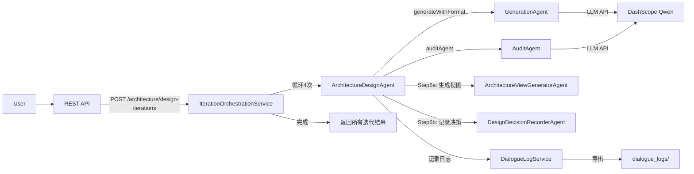

# 多 Agent 架构设计系统（ADD 3.0 + HPS）

基于 **Java 17 + Spring Boot 3 + Spring AI Alibaba（DashScope/百炼）** 的多 Agent 系统，用于完成 ADD 3.0 架构设计方法论的 4 次迭代。

## Agent 架构

### 核心 Agent（5 个）

| Agent | 职责 | 说明 |
|-------|------|------|
| **GenerationAgent** | 通用生成 | 根据 prompt 生成内容；新增 `generateWithFormat()` 支持结构化输出 |
| **AuditAgent** | 内容审计 | 对生成结果做安全/准确性/完整性审查，输出结构化 JSON |
| **ArchitectureDesignAgent** ⭐ | ADD 流程驱动 | 驱动 ADD 3.0 的 7 个步骤，完成一次迭代的完整架构设计 |
| **ArchitectureViewGeneratorAgent** | 视图生成 | 根据架构设计生成 Mermaid 格式的架构图（C1/C2/C3/部署图等） |
| **DesignDecisionRecorderAgent** | 决策记录 | 将架构决策结构化记录，生成 ADR（Architecture Decision Record） |

### 编排服务（2 个）

| Service | 职责 | 说明 |
|---------|------|------|
| **MultiAgentOrchestratorService** | 单次生成+审计 | 旧系统：生成 → 审计 → 重试 |
| **IterationOrchestrationService** ⭐ | 4 迭代管理 | 新系统：驱动 4 次迭代的完整 ADD 设计，维护迭代间上下文 |

### 日志服务

| Service | 职责 | 说明 |
|---------|------|------|
| **DialogueLogService** | 对话记录 | 记录所有交互的完整日志（含时间戳），支持导出为 Markdown |

## 工作流程（ADD 3.0 - 4 次迭代）

```mermaid
flowchart TD
    user[用户] -->|启动4迭代设计| api[/architecture/design-iterations]
    api --> orch[IterationOrchestrationService]
    
    orch -->|迭代1| iter1["迭代1: 建立整体系统结构"]
    orch -->|迭代2| iter2["迭代2: 确定支持主要功能的架构"]
    orch -->|迭代3| iter3["迭代3: 处理可靠性与可用性"]
    orch -->|迭代4| iter4["迭代4: 处理开发与运维"]
    
    iter1 --> arch1["ArchitectureDesignAgent"]
    iter2 --> arch2["ArchitectureDesignAgent"]
    iter3 --> arch3["ArchitectureDesignAgent"]
    iter4 --> arch4["ArchitectureDesignAgent"]
    
    arch1 -->|调用| gen1["GenerationAgent.generateWithFormat"]
    arch2 -->|调用| gen2["GenerationAgent.generateWithFormat"]
    arch3 -->|调用| gen3["GenerationAgent.generateWithFormat"]
    arch4 -->|调用| gen4["GenerationAgent.generateWithFormat"]
    
    gen1 -->|LLM| llm["DashScope Qwen"]
    gen2 -->|LLM| llm
    gen3 -->|LLM| llm
    gen4 -->|LLM| llm
    
    arch1 -->|Step6: 视图生成| view1["ArchitectureViewGeneratorAgent"]
    arch1 -->|Step6: 决策记录| decision1["DesignDecisionRecorderAgent"]
    
    arch1 -->|记录日志| log["DialogueLogService"]
    arch2 -->|记录日志| log
    arch3 -->|记录日志| log
    arch4 -->|记录日志| log
    
    log -->|导出| report["complete_dialogue_log.md"]
```

### ADD 3.0 的 7 个步骤

每次迭代中，**ArchitectureDesignAgent** 完成以下步骤：

1. **评审输入** - 识别架构驱动因素（需求、质量属性、约束）
2. **确定迭代目标** - 选择本轮重点解决的问题
3. **选择系统要素** - 确定要设计的架构要素（系统、模块等）
4. **选择设计概念** - 评估多个方案，选择最优设计
5. **实例化架构要素** - 定义具体的组件、职责、接口
6. **勾勒视图、记录决策** - 生成架构图 + ADR 记录
7. **分析设计** - 评估是否满足迭代目标，判断是否继续迭代

### 关键特性

- ✅ **ADD 3.0 完整实现**：按照 7 个步骤迭代设计架构
- ✅ **HPS 业务上下文**：预装酒店定价系统的 6 个用例、9 个质量属性、6 个关注点、6 个约束
- ✅ **结构化设计输出**：使用特殊分隔符标记各步骤输出，便于解析和追踪
- ✅ **完整对话日志**：记录每次迭代的完整交互，支持导出为 Markdown
- ✅ **架构决策追踪**：记录设计决策的背景、方案、理由
- ✅ **视图自动生成**：生成 Mermaid 格式的架构图

## 环境要求

- JDK 17+
- Maven 3.9+
- 阿里云百炼 API Key（环境变量 `AI_DASHSCOPE_API_KEY`）

## 快速启动

```powershell
# Windows PowerShell
$env:AI_DASHSCOPE_API_KEY="sk-你的百炼API密钥"

# 可选：指定模型（默认 qwen3-235b-a22b-instruct-2507）
$env:DASHSCOPE_MODEL="qwen3-235b-a22b-instruct-2507"

mvn spring-boot:run
```

服务默认端口：`8080`

## API 端点

### 1. 健康检查
- **GET** `http://localhost:8080/api/v1/agents/health`
- 返回：`{"status": "UP", "service": "multi-agent-system"}`

### 2. 启动完整的 ADD 4 迭代设计 ⭐（新）
- **POST** `http://localhost:8080/api/v1/agents/architecture/design-iterations`
- **Header**：`Content-Type: application/json`
- **无需 Body**（或空 `{}`）
- **返回**：
  ```json
  {
    "status": "success",
    "message": "完成了4次迭代的架构设计",
    "iterationCount": 4,
    "results": [
      {
        "iteration": 1,
        "objective": "建立整体系统结构 - 定义顶层架构和核心模块",
        "executionTimeMs": 45000,
        "traceId": "trace_1234567890"
      },
      ...
    ]
  }
  ```

### 3. 通用的生成 + 审计（旧接口）
- **POST** `http://localhost:8080/api/v1/agents/generate-and-audit`
- **Header**：`Content-Type: application/json`
- **Body（raw / JSON）**：
  ```json
  {
    "input": "请解释软件体系结构中的分层架构",
    "context": "课程作业"
  }
  ```

## 核心接口

### 旧系统（通用生成+审计）
`POST /api/v1/agents/generate-and-audit`

### 新系统（ADD 3.0 设计）✨
`POST /api/v1/agents/architecture/design-iterations`

## 对话日志导出

完成 4 次迭代后，系统自动生成完整对话日志：

- **文件位置**：`./dialogue_logs/complete_dialogue_log.md`
- **内容**：包含 4 个迭代的所有交互、决策记录、时间戳
- **用途**：直接用于课程作业提交（要求的"完整交互对话日志"）

## 项目结构

```
src/main/java/com/rampantie/multiagent/
├── agent/
│   ├── GenerationAgent.java                ✓ 通用生成（新增 generateWithFormat 方法）
│   ├── AuditAgent.java                     ✓ 内容审计
│   ├── ArchitectureDesignAgent.java        ✨ 新：ADD 3.0 驱动
│   ├── ArchitectureViewGeneratorAgent.java ✨ 新：视图生成
│   └── DesignDecisionRecorderAgent.java    ✨ 新：决策记录
├── service/
│   ├── MultiAgentOrchestratorService.java  ✓ 单次生成+审计
│   ├── IterationOrchestrationService.java  ✨ 新：4 迭代驱动
│   └── DialogueLogService.java             ✨ 新：对话日志记录
├── domain/
│   ├── AddIterationResult.java             ✨ 新：迭代结果模型
│   ├── DesignDecision.java                 ✨ 新：架构决策 ADR
│   ├── IterationContext.java               ✨ 新：迭代上下文
│   └── AddPromptTemplates.java             ✨ 新：ADD 提示词模板
├── controller/
│   └── AgentController.java                ✓ REST 端点（已扩展）
├── api/dto/                                ✓ 请求/响应模型
├── config/                                 ✓ 配置类
└── exception/                              ✓ 异常处理
```

## 配置说明

[`src/main/resources/application.yml`](src/main/resources/application.yml)

| 配置项 | 说明 |
|--------|------|
| `AI_DASHSCOPE_API_KEY` | 百炼 API Key（`sk-` 开头） |
| `DASHSCOPE_MODEL` | 模型名，默认 `qwen3-235b-a22b-instruct-2507` |
| `multi-agent.orchestration.max-retries` | 审计不通过时最多重生成次数，默认 `2` |

### Qwen3-235B-A22B 模型选择

| 用途 | model 值 |
|------|----------|
| 架构设计、指令遵循（推荐） | `qwen3-235b-a22b-instruct-2507` |
| 思考链模式（复杂推理） | `qwen3-235b-a22b-thinking-2507` |

在 [百炼控制台](https://bailian.console.aliyun.com/) 确认已开通对应模型；API Key 地域需与模型服务地域一致。

### 审计规则概要

审计 Agent 按 [`application.yml`](src/main/resources/application.yml) 中 `multi-agent.audit.system-prompt` 执行，主要维度：

| 维度 | 不通过典型情况 |
|------|----------------|
| 安全合规 | 违法、暴力、仇恨、隐私泄露、虚假信息等 |
| 准确可信 | 答非所问、概念错误、把推测当定论、关键约束遗漏 |
| 完整结构 | 缺结论/步骤、对比题未覆盖要点、回答过短敷衍 |
| 轻微瑕疵 | 表述冗余、缺例子等 → 可通过，`riskLevel=LOW` |

修改规则后需重启服务生效。

## 测试

```bash
mvn test
```

## 工作流程图



## 系统指令结构

### ArchitectureDesignAgent 的 System Prompt 包含：

1. **HPS 业务上下文**
   - 6 个主要用例 (HPS-1 到 HPS-6)
   - 9 个质量属性 (Q-1 到 Q-9)
   - 6 个架构关注点 (CRN-1 到 CRN-5)
   - 6 个约束 (CON-1 到 CON-6)

2. **ADD 3.0 方法论**
   - 7 个步骤的完整定义
   - 输出格式要求（使用特殊分隔符）
   - 各类型图表要求

3. **前置迭代信息**
   - 前面迭代的设计成果
   - 待继续完善的内容

### GenerationAgent 的新增方法

`generateWithFormat(userInput, context, outputFormat, previousAttempt, feedback)`

支持指定输出格式，通过参数 `outputFormat` 控制 LLM 的输出结构。

## 输出示例

### 对话日志格式

```markdown
# 多智能体架构设计系统 - 完整对话日志

生成时间: 2026-05-25 14:30:45

## 迭代 1

### START - IterationOrchestrator (迭代 1 开始)
时间: 2026-05-25 14:30:45
...

### EXECUTION - ArchitectureDesignAgent (步骤 1)
时间: 2026-05-25 14:31:00
Agent: ArchitectureDesignAgent
...

### DECISION - DesignDecisionRecorder (决策记录)
决策: 采用微服务架构
理由: 支持独立部署和扩展
...

### COMPLETE - IterationOrchestrator (迭代 1 完成)
...
```

## 架构设计迭代计划

| 迭代 | 目标 | 关键驱动因素 |
|------|------|------------|
| 1 | 建立整体系统结构 | CRN-1, CRN-2 |
| 2 | 确定支持主要功能的架构 | HPS-1 到 HPS-6, Q-1 到 Q-5 |
| 3 | 处理可靠性与可用性 | Q-2, Q-3, Q-8, Q-9 |
| 4 | 处理开发与运维 | CRN-3, CRN-4, CRN-5, Q-7, Q-8 |

## 关键特性

✨ **ADD 3.0 完整支持**
- 严格遵循 ADD 3.0 的 7 个步骤
- 每个步骤都有明确的输入/输出
- 支持决策追踪和理由记录

✨ **HPS 业务上下文预装**
- 无需手工注入，系统自带完整业务背景
- 涵盖所有用例、质量属性、约束、关注点

✨ **完整审计链**
- 关键步骤（Step 5）自动审计
- 审计失败自动改进重试

✨ **对话日志完整记录**
- 记录每次交互（包含时间戳）
- 支持导出为 Markdown 供提交

✨ **架构决策追踪**
- 自动记录设计决策的背景、备选方案、理由
- 支持追溯某个决策为什么做出

✨ **多迭代支持**
- 迭代间上下文自动传递
- 支持前后迭代对比
