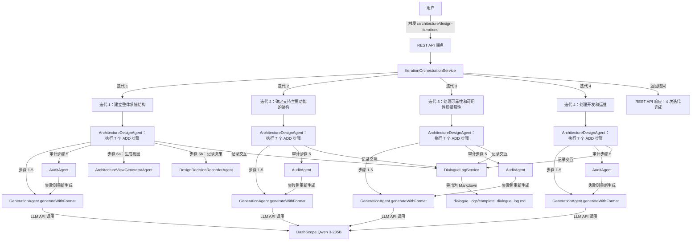

# 多智能体架构设计系统（ADD 3.0 + HPS）

基于 **Java 17 + Spring Boot 3 + Spring AI Alibaba（DashScope/百炼）** 的多智能体系统，用于完成 ADD 3.0（属性驱动设计）架构设计方法论的 4 次迭代。

## 快速启动

### 系统要求

- JDK 17+
- Maven 3.9+
- 阿里云百炼 API Key（设置为环境变量 `AI_DASHSCOPE_API_KEY`）

### 启动步骤

#### 1. 设置 API 密钥

**Windows (PowerShell):**

```powershell
$env:AI_DASHSCOPE_API_KEY="sk-你的百炼API密钥"
$env:DASHSCOPE_MODEL="qwen3-235b-a22b-instruct-2507"
```

**Linux/macOS (Bash):**

```bash
export AI_DASHSCOPE_API_KEY="sk-你的百炼API密钥"
export DASHSCOPE_MODEL="qwen3-235b-a22b-instruct-2507"
```

#### 2. 构建和运行

```bash
# 构建项目
mvn clean package -DskipTests

# 运行 Spring Boot 应用
mvn spring-boot:run
```

服务将在默认端口启动：**`8080`**

#### 3. 触发架构设计迭代

**方式 A：使用 cURL**

```bash
curl -X POST http://localhost:8080/api/v1/agents/architecture/design-iterations \
  -H "Content-Type: application/json" \
  -d "{}"
```

**方式 B：使用 Postman**

- 方法：`POST`
- URL：`http://localhost:8080/api/v1/agents/architecture/design-iterations`
- Headers：`Content-Type: application/json`
- Body：`{}` （空 JSON 对象）

系统将执行全部 4 次 ADD 迭代，并自动生成完整的对话日志。

> **说明**：触发后请等待系统完成迭代（大约 5-15 分钟）。系统会在控制台输出进度，完成后在 `dialogue_logs/` 目录生成对话日志。

---

## 输入输出位置

### 输出文件和日志

| 文件/目录          | 位置                                       | 用途           | 说明                                     |
| ------------------ | ------------------------------------------ | -------------- | ---------------------------------------- |
| **对话日志**       | `./dialogue_logs/complete_dialogue_log.md` | 课程作业提交   | 4 个迭代的完整交互日志（英文）           |
| **控制台输出**     | 控制台/终端                                | 实时进度监控   | 显示每次迭代的开始/完成和 token 统计     |
| **Token 统计报告** | 对话日志内                                 | Token 消耗分析 | 每个步骤的详细 token 消耗和 API 调用计数 |

### 如何访问输出文件

通过 API 端点触发设计迭代后，系统将自动：

1. **执行 4 次迭代**（约 5-15 分钟，取决于 LLM 响应时间）
2. **实时记录**所有智能体交互到内存
3. **自动生成**完整对话日志为 `./dialogue_logs/complete_dialogue_log.md`
4. **包含 Token 统计**在同一文件内

**查看和获取生成的文件：**

```bash
# 查看完整的对话日志
cat dialogue_logs/complete_dialogue_log.md

# 复制到作业提交目录（推荐）
cp dialogue_logs/complete_dialogue_log.md ~/homework/
```

> **注意**：对话日志已是 Markdown 格式，包含所有必需的信息和统计，可直接提交作业

---

## 智能体架构

### 核心智能体（5 个）

| 智能体                             | 职责         | 说明                                                                     |
| ---------------------------------- | ------------ | ------------------------------------------------------------------------ |
| **GenerationAgent**                | 内容生成     | 根据 prompt 生成架构设计内容；新增 `generateWithFormat()` 支持结构化输出 |
| **AuditAgent**                     | 质量审计     | 审查生成内容的准确性、完整性和合规性；输出结构化 JSON                    |
| **ArchitectureDesignAgent** ⭐     | ADD 3.0 编排 | 驱动 7 步 ADD 方法论；编排一次完整的架构设计迭代                         |
| **ArchitectureViewGeneratorAgent** | 视图生成     | 生成 Mermaid 格式的架构图（C1/C2/C3/部署/监控视图）                      |
| **DesignDecisionRecorderAgent**    | 决策记录     | 结构化记录架构决策；生成架构决策记录（ADR）                              |

### 编排服务（2 个）

| 服务                                 | 职责          | 说明                                             |
| ------------------------------------ | ------------- | ------------------------------------------------ |
| **MultiAgentOrchestratorService**    | 单次生成+审计 | 旧系统：生成 → 审计 → 重试                       |
| **IterationOrchestrationService** ⭐ | 4 迭代管理    | 新系统：驱动 4 次完整 ADD 迭代；维护迭代间上下文 |

### 日志服务

| 服务                   | 职责         | 说明                                                                            |
| ---------------------- | ------------ | ------------------------------------------------------------------------------- |
| **DialogueLogService** | 对话日志记录 | 记录所有智能体执行的完整交互日志（含时间戳）；支持 Markdown 导出                |
| **TokenUsageTracker**  | Token 计数   | 追踪实际 API 调用和真实 token 消耗（中文：每字 1 token；英文：每词 0.25 token） |

---

## 执行流程（ADD 3.0 - 4 次迭代）



### ADD 3.0 七个步骤（每次迭代）

**ArchitectureDesignAgent** 在每次迭代中遵循以下步骤：

1. **步骤 1 - 评审输入**：识别架构驱动因素（需求、质量属性、约束）
2. **步骤 2 - 确定迭代目标**：选择本轮重点解决的问题
3. **步骤 3 - 选择系统要素**：选择要设计的架构要素（系统、子系统、模块）
4. **步骤 4 - 选择设计概念**：评估多个设计方案；选择最优方案
5. **步骤 5 - 实例化架构要素**：定义具体的组件、职责、接口、关系
6. **步骤 6a - 生成架构视图**：创建 Mermaid 图表（C1 系统上下文、C2 容器、C3 组件等）
7. **步骤 6b - 记录架构决策**：用背景、备选项、理由、质量属性记录关键设计决策
8. **步骤 7 - 分析设计**：评估是否满足迭代目标；判断是否需要继续迭代

---

## API 端点

### 1. 健康检查

**GET** `http://localhost:8080/api/v1/agents/health`

响应：

```json
{
  "status": "UP",
  "service": "multi-agent-system"
}
```

### 2. 执行完整的 ADD 4 迭代设计 ⭐ （主入口）

**POST** `http://localhost:8080/api/v1/agents/architecture/design-iterations`

Headers:

```
Content-Type: application/json
```

Body：（空 JSON 对象，无需额外参数）

```json
{}
```

响应：

```json
{
  "status": "success",
  "message": "完成了 4 次迭代的架构设计",
  "iterationCount": 4,
  "totalExecutionTimeMs": 180000,
  "results": [
    {
      "iteration": 1,
      "objective": "建立整体系统结构 - 定义顶层架构和核心模块",
      "status": "SUCCESS",
      "executionTimeMs": 45000,
      "traceId": "trace_1234567890",
      "step7AnalysisOutput": "[迭代 1 的最终分析]"
    },
    {
      "iteration": 2,
      "objective": "确定支持主要功能的架构 - 完善 6 个 HPS 用例的实现",
      "status": "SUCCESS",
      "executionTimeMs": 45000,
      "traceId": "trace_1234567891",
      "step7AnalysisOutput": "[迭代 2 的最终分析]"
    },
    {
      "iteration": 3,
      "objective": "处理可靠性和可用性质量属性 - 设计高可靠高可用系统",
      "status": "SUCCESS",
      "executionTimeMs": 45000,
      "traceId": "trace_1234567892",
      "step7AnalysisOutput": "[迭代 3 的最终分析]"
    },
    {
      "iteration": 4,
      "objective": "处理开发与运维 - 部署架构、监控、CI/CD、团队分配",
      "status": "SUCCESS",
      "executionTimeMs": 45000,
      "traceId": "trace_1234567893",
      "step7AnalysisOutput": "[迭代 4 的最终分析]"
    }
  ]
}
```

### 3. 旧系统：生成 + 审计（遗留接口）

**POST** `http://localhost:8080/api/v1/agents/generate-and-audit`

Headers:

```
Content-Type: application/json
```

Body:

```json
{
  "input": "请解释软件体系结构中的分层架构",
  "context": "课程作业上下文"
}
```

---

## 输出对话日志结构

### Markdown 导出格式

`complete_dialogue_log.md` 文件包含：

```markdown
# 多智能体架构设计系统 - 完整对话日志和设计文档

生成时间：2026-05-27 14:30:45

---

## 迭代 1：建立整体系统结构 - 定义顶层架构和核心模块

### START - IterationOrchestrator

时间：2026-05-27 14:30:45
状态：迭代开始
目标：建立整体系统结构 - 定义顶层架构和核心模块

---

### EXECUTION - ArchitectureDesignAgent

时间：2026-05-27 14:31:00
智能体：ArchitectureDesignAgent
追踪 ID：trace_1234567890

#### 步骤 1：评审输入

[识别的架构驱动因素...]

#### 步骤 2：确定迭代目标

[迭代目标和重点...]

#### 步骤 3：选择系统要素

[要精化的已选择元素...]

#### 步骤 4：选择设计概念

[评估的多个设计方案...]

#### 步骤 5：实例化架构要素

[具体的组件和接口定义...]

#### 步骤 6a：生成架构视图

[代码块中的 Mermaid 图表]

#### 步骤 6b：记录设计决策

[带有理由的结构化决策记录...]

#### 步骤 7：分析设计

[目标是否被满足的分析...]

---

### TOKEN 使用统计 - 迭代 1

总计 Token：8750

- GenerationAgent：6500 tokens（步骤 1-7 生成）
- AuditAgent：2250 tokens（步骤 5 审计）
- 总计实际 API 调用：3 次（2 次生成 + 1 次审计）

---

### COMPLETE - IterationOrchestrator

时间：2026-05-27 14:32:15
状态：迭代完成
执行时间：90 秒

---

## 迭代 2：确定支持主要功能的架构...

[迭代 2-4 的相似结构]

---

## TOKEN 使用分析 - 汇总

### 各步骤 Token 使用详情

| 智能体          | 步骤 | 输入 Token | 输出 Token | 总 Token |
| --------------- | ---- | ---------- | ---------- | -------- |
| GenerationAgent | 5    | 2500       | 1200       | 3700     |
| GenerationAgent | 6    | 1800       | 850        | 2650     |
| AuditAgent      | 5    | 1200       | 600        | 1800     |
| ...             | ...  | ...        | ...        | ...      |

### API 交互统计

- 总实际 API 调用：12 次
- GenerationAgent 调用：8 次
- AuditAgent 调用：4 次
- 完成的迭代总数：4
- 成功迭代：4
- 失败审计（重新生成）：2 次

### 成本估算

（基于百炼定价：输入 Token ¥0.0005/1K，输出 Token ¥0.0015/1K）

- 总输入 Token：28,750
- 总输出 Token：18,250
- 估算成本：¥17.58 CNY
```

---

## 文件结构和组织

```
SoftwareArchitectureDesign_MultiAgent/
├── src/main/java/com/rampantie/multiagent/
│   ├── agent/
│   │   ├── GenerationAgent.java                    - 核心内容生成
│   │   ├── AuditAgent.java                         - 质量审计
│   │   ├── ArchitectureDesignAgent.java            - ADD 3.0 编排（新增）
│   │   ├── ArchitectureViewGeneratorAgent.java     - Mermaid 图表生成（新增）
│   │   └── DesignDecisionRecorderAgent.java        - 决策记录（新增）
│   ├── service/
│   │   ├── MultiAgentOrchestratorService.java      - 单次：生成 + 审计
│   │   ├── IterationOrchestrationService.java      - 4 迭代编排（新增）
│   │   ├── DialogueLogService.java                 - 交互日志记录（新增）
│   │   └── TokenUsageTracker.java                  - Token 计数（新增）
│   ├── domain/
│   │   ├── AddIterationResult.java                 - 迭代结果模型（新增）
│   │   ├── DesignDecision.java                     - 架构决策记录（新增）
│   │   ├── IterationContext.java                   - 迭代上下文（新增）
│   │   ├── AddPromptTemplates.java                 - ADD 3.0 提示词模板（新增）
│   │   └── TokenUsage.java                         - Token 使用数据模型（新增）
│   ├── controller/
│   │   └── AgentController.java                    - REST API 端点
│   ├── audit/
│   │   ├── AuditDecision.java                      - 审计结果模型
│   │   └── AuditResultParser.java                  - 审计 JSON 解析器
│   ├── api/dto/                                    - 请求/响应模型
│   ├── config/                                     - Spring 配置
│   └── exception/                                  - 异常类
│
├── src/main/resources/
│   ├── application.yml                             - 应用配置
│   └── logback-spring.xml                          - 日志配置
│
├── dialogue_logs/
│   └── complete_dialogue_log.md                    - 生成的对话日志（输出）
│
├── pom.xml                                         - Maven 配置
└── README.md                                       - 本文件
```

---

## 配置

### 环境变量

| 变量                   | 值                              | 说明                                |
| ---------------------- | ------------------------------- | ----------------------------------- |
| `AI_DASHSCOPE_API_KEY` | `sk-xxxxx`                      | **必需**：来自阿里云的百炼 API 密钥 |
| `DASHSCOPE_MODEL`      | `qwen3-235b-a22b-instruct-2507` | LLM 模型名（默认值）                |

### 应用配置（`src/main/resources/application.yml`）

```yaml
spring:
  ai:
    dashscope:
      api-key: ${AI_DASHSCOPE_API_KEY}
      model: ${DASHSCOPE_MODEL:qwen3-235b-a22b-instruct-2507}

multi-agent:
  orchestration:
    max-retries: 2 # 审计失败时最多重生成次数
  dialogue-log:
    export-format: markdown # 对话日志导出格式
```

### 模型选择

| 模型                            | 用途               | 建议                 |
| ------------------------------- | ------------------ | -------------------- |
| `qwen3-235b-a22b-instruct-2507` | 架构设计、指令遵循 | ✅ 推荐用于本系统    |
| `qwen3-235b-a22b-thinking-2507` | 复杂推理、链式思考 | 高级用途（速度较慢） |

**验证模型可用性**：在 [阿里云百炼控制台](https://bailian.console.aliyun.com/) 确认模型已开通，且 API Key 地域与模型服务地域一致。

---

## 数据流和 Token 追踪

### 真实 Token 消耗算法

系统追踪**实际的 token 消耗**（非估算值）：

**中文字符处理：**

- 1 个中文字符（0x4E00-0x9FFF）= 1 token
- 示例："架构设计"（4 字符）= 4 tokens

**英文文本处理：**

- 平均每个英文词 0.25 token（基于百炼分词）
- 示例："system architecture"（2 词）≈ 0.5 tokens

**空格：**

- 空格和换行不计数

**交互追踪：**

- 每个 API 调用（GenerationAgent 或 AuditAgent）计为 1 次交互
- 总交互数 = 实际 LLM API 调用次数
- 审计失败时，重新生成计为额外的交互

### Token 使用报告示例

```
# Token 使用分析 - 汇总

| 智能体 | 步骤 | 输入 Token | 输出 Token | 总 Token |
|-------|------|-----------|----------|---------|
| GenerationAgent | 5 | 2500 | 1200 | 3700 |
| AuditAgent | 5 | 1200 | 600 | 1800 |
| GenerationAgent | 6 | 1800 | 850 | 2650 |

**总实际 API 调用**：3 次
**总 Token 消耗**：8150
**估算成本**（按百炼价格）：¥4.87 CNY
```

---

## 酒店定价系统（HPS）- 内置业务上下文

系统预装了酒店定价系统的完整业务上下文：

### 用例（6 个）

- **HPS-1**：登录 - 用户身份认证和授权
- **HPS-2**：修改价格 - 修改基础房价，实时发布价格
- **HPS-3**：查询价格 - 通过 UI 或 API 检索价格
- **HPS-4**：管理酒店 - 管理员管理酒店信息
- **HPS-5**：管理房价 - 定义业务规则和房价类型
- **HPS-6**：管理用户 - 用户权限管理

### 质量属性（9 个）

- **Q-1 性能**：价格发布 <100ms
- **Q-2 可靠性**：100% 成功发布价格变更
- **Q-3 可用性**：99.9% 正常运行时间 SLA
- **Q-4 可扩展性**：支持 10 万-100 万查询/天，延迟增加 ≤20%
- **Q-5 安全性**：登录验证、权限控制、凭证存储
- **Q-6 可修改性**：添加 gRPC 端点无需修改核心
- **Q-7 可部署性**：跨环境迁移无需代码修改
- **Q-8 可监控性**：采集 100% 的性能/可靠性数据
- **Q-9 可测试性**：100% 支持集成测试

### 架构关注点（5 个）

- **CRN-1**：建立整体系统结构
- **CRN-2**：利用团队在 Java、Angular、Kafka 的专业知识
- **CRN-3**：为开发团队成员分配工作
- **CRN-4**：避免引入技术债
- **CRN-5**：建立持续部署基础设施

### 约束（6 个）

- **CON-1**：基于 Web 浏览器，支持跨平台
- **CON-2**：云端身份服务，云端托管资源
- **CON-3**：专有 Git 平台上的代码
- **CON-4**：6 个月完整交付，2 个月 MVP 演示
- **CON-5**：REST API（可扩展其他协议）
- **CON-6**：优先云原生方案

---

## 构建和测试

### 构建项目

```bash
# 清理构建（不运行测试，速度快）
mvn clean package -DskipTests

# 完整构建（包含测试）
mvn clean package
```

### 运行测试

```bash
# 运行所有测试
mvn test

# 运行特定测试类
mvn test -Dtest=GenerationAgentTest
```

### Maven 依赖

关键依赖：

- **Spring Boot 3.x** - 应用框架
- **Spring AI Alibaba** - LLM 集成
- **Spring AI Core** - AI 抽象层
- **DashScope SDK** - 阿里云 API 客户端
- **JUnit 5** - 测试框架

---

## 核心特性

✅ **完整的 ADD 3.0 实现**

- 严格遵循 7 步架构设计方法论
- 每个步骤都有明确的输入/输出和验证
- 支持决策追踪和理由记录

✅ **酒店定价系统（HPS）业务上下文预装**

- 无需手工注入；系统包含完整的业务上下文
- 涵盖 6 个用例、9 个质量属性、5 个关注点、6 个约束
- 整个 4 次迭代中保持一致的上下文

✅ **完整的审计链**

- 步骤 5（架构实例化）自动审计准确性
- 审计失败自动重新生成并反馈
- 可配置的最大重试次数（默认：2 次）

✅ **完整的对话日志记录**

- 记录每个智能体执行的交互（含时间戳）
- 支持导出为 Markdown 供课程作业提交
- 包括所有交互、决策和分析

✅ **架构决策追踪**

- 自动记录关键设计决策
- 捕获决策背景、考虑的备选方案、理由和质量属性
- 支持架构决策的可追溯性

✅ **多迭代上下文保留**

- 迭代间的上下文自动传递
- 支持跨迭代的架构精化
- 支持前后迭代的兼容性检查

✅ **真实 Token 计数**

- 实际 token 消耗追踪（非估算）
- 中英文字符差异化处理
- API 交互计数
- 基于真实使用的成本估算

✅ **纯英文生成**

- 所有智能体输出以英文生成
- 所有系统提示词中都有明确的英文指令
- 支持国际课程作业提交

---

## 故障排除

### 问题：找不到 API 密钥

**错误信息：**

```
No property 'AI_DASHSCOPE_API_KEY' found
```

**解决方案：**

1. 验证环境变量是否设置：`echo $AI_DASHSCOPE_API_KEY`
2. 设置变量后重启终端/IDE
3. 或直接添加到 `application.yml`（不推荐，涉及安全问题）

### 问题：模型不可用

**错误信息：**

```
Model qwen3-235b-a22b-instruct-2507 not found
```

**解决方案：**

1. 在 [百炼控制台](https://bailian.console.aliyun.com/) 验证模型可用性
2. 检查 API Key 地域与模型服务地域是否一致
3. 在环境变量中切换到可用模型

### 问题：连接超时

**错误信息：**

```
Connection timeout after 30000ms
```

**解决方案：**

1. 检查网络连接
2. 验证 API 端点可访问：`curl https://dashscope.aliyuncs.com/api/v1/apps/agent/completion`
3. 如需要可在 `application.yml` 中增加超时时间

### 问题：对话日志未生成

**错误信息：** API 调用后 `dialogue_logs/complete_dialogue_log.md` 文件不存在

**解决方案：**

1. 检查 `dialogue_logs/` 目录是否存在；如不存在则创建
2. 验证 Spring Boot 应用是否仍在运行
3. 检查控制台是否有错误信息
4. 确保至少 1 次迭代成功完成

---

## 课程作业工作流

从开始到提交只需 6 个步骤：

### 第 1 步：准备环境

```bash
# 设置 API 密钥（必需）
export AI_DASHSCOPE_API_KEY="sk-你的百炼密钥"

# 验证密钥设置
echo $AI_DASHSCOPE_API_KEY
```

### 第 2 步：启动系统

```bash
# 进入项目目录
cd SoftwareArchitectureDesign_MultiAgent

# 构建和运行
mvn clean package -DskipTests
mvn spring-boot:run
```

等待看到 `Started Application in X seconds` 消息，表示系统已启动。

### 第 3 步：触发设计迭代

在新终端中执行（保持上一个终端运行）：

```bash
# 方式 1：使用 cURL（推荐）
curl -X POST http://localhost:8080/api/v1/agents/architecture/design-iterations \
  -H "Content-Type: application/json" \
  -d "{}"

# 方式 2：使用 Postman
# POST 地址：http://localhost:8080/api/v1/agents/architecture/design-iterations
# Headers：Content-Type: application/json
# Body：{}
```

### 第 4 步：监控执行

观察第 2 步的终端输出，会依次看到：

```
[INFO] Iteration 1 started: Establish overall system structure...
[INFO] Iteration 1 completed. Execution time: 45000ms
[INFO] Iteration 2 started: Identify architecture supporting main functions...
[INFO] Iteration 2 completed. Execution time: 48000ms
...
[INFO] All 4 iterations completed successfully
```

- 每次迭代约需 1-5 分钟
- 全部 4 次迭代总耗时：约 5-15 分钟

### 第 5 步：获取生成的作业文件

```bash
# 查看对话日志（验证内容）
cat dialogue_logs/complete_dialogue_log.md

# 统计行数（应有 3000+ 行）
wc -l dialogue_logs/complete_dialogue_log.md

# 复制到作业提交目录
cp dialogue_logs/complete_dialogue_log.md ~/homework/
```

### 第 6 步：提交作业

提交 `complete_dialogue_log.md` 文件，包含：

- ✅ 4 次完整的 ADD 3.0 架构设计迭代
- ✅ 所有智能体的交互日志（含精确时间戳）
- ✅ 架构决策记录和设计理由
- ✅ Mermaid 架构图（C1、C2、C3、部署、监控）
- ✅ 详细的 Token 使用统计和成本分析
- ✅ 全部内容为英文（符合国际标准）

---

## 其他资源

- **ADD 3.0 参考**：[IEEE 软件架构设计](https://www.sei.cmu.edu/publications/)
- **Mermaid 图表语法**：[Mermaid 官方文档](https://mermaid.js.org/)
- **百炼 API**：[阿里云百炼](https://dashscope.aliyun.com/)
- **Spring AI**：[Spring AI 官方文档](https://docs.spring.io/spring-ai/reference/)

---

## 许可证

本项目作为软件体系结构设计课程的一部分创建，用于教育目的。

---

**最后更新**：2026-05-27
**系统版本**：1.0
**状态**：完成，可进行课程作业提交
