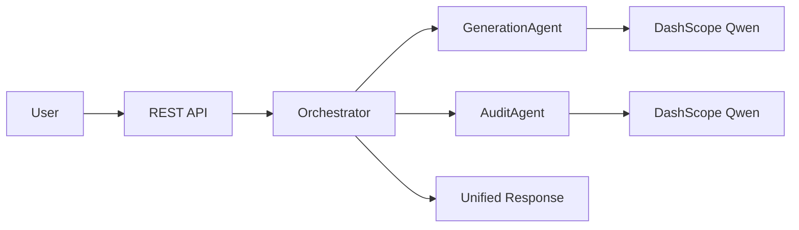

# 双 Agent 系统（生成 + 审计）

基于 **Java 17 + Spring Boot 3 + Spring AI Alibaba（DashScope/百炼）** 的多 Agent MVP：

1. **生成 Agent**：根据用户输入生成回答  
2. **审计 Agent**：对生成结果做安全/合规审计，输出结构化 JSON  
3. **编排服务**：串联「生成 → 审计」，返回统一 API 响应  

## 环境要求

- JDK 17+
- Maven 3.9+
- 阿里云百炼 API Key（环境变量 `AI_DASHSCOPE_API_KEY`）

## 快速启动

```powershell
# Windows PowerShell
$env:AI_DASHSCOPE_API_KEY="sk-你的百炼API密钥"

# 可选：指定模型（默认 qwen3-235b-a22b-instruct-2507）
$env:DASHSCOPE_MODEL="qwen3-235b-a22b-instruct-2507"

mvn spring-boot:run
```

服务默认端口：`8080`

## Postman 测试

### 健康检查

- **GET** `http://localhost:8080/api/v1/agents/health`

### 生成 + 审计

- **POST** `http://localhost:8080/api/v1/agents/generate-and-audit`
- **Header**：`Content-Type: application/json`
- **Body（raw / JSON）**：

```json
{
  "input": "请解释软件体系结构中的分层架构",
  "context": "课程作业"
}
```

## 核心接口

`POST /api/v1/agents/generate-and-audit`

响应字段：`traceId`、`generatedAnswer`、`finalAnswer`、`approved`、`audit`。

## 配置说明

[`src/main/resources/application.yml`](src/main/resources/application.yml)

| 配置项 | 说明 |
|--------|------|
| `AI_DASHSCOPE_API_KEY` | 百炼 API Key（`sk-` 开头） |
| `DASHSCOPE_MODEL` | 模型名，默认 `qwen3-235b-a22b-instruct-2507` |

### 使用 Qwen3-235B-A22B（百炼）

| 用途 | model 值 |
|------|----------|
| 对话 / 指令遵循（推荐） | `qwen3-235b-a22b-instruct-2507` |
| 思考链模式 | `qwen3-235b-a22b-thinking-2507` 或 `qwen3-235b-a22b` |

在 [百炼控制台](https://bailian.console.aliyun.com/) 确认已开通对应模型；API Key 地域需与模型服务地域一致。

## 测试

```bash
mvn test
```

## 流程说明


