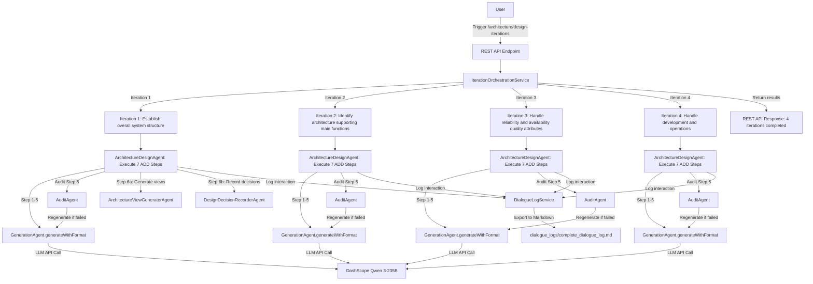

# Multi-Agent Architecture Design System (ADD 3.0 + HPS)

A multi-agent system based on **Java 17 + Spring Boot 3 + Spring AI Alibaba (DashScope/Qwen)** for completing 4 iterations of ADD 3.0 (Attribute-Driven Design) architecture design methodology.

## Quick Start

### Prerequisites

- JDK 17+
- Maven 3.9+
- Alibaba Cloud DashScope API Key (set as environment variable `AI_DASHSCOPE_API_KEY`)

### Startup Instructions

#### 1. Set API Key

**On Windows (PowerShell):**
```powershell
$env:AI_DASHSCOPE_API_KEY="sk-your-dashscope-api-key"
$env:DASHSCOPE_MODEL="qwen3-235b-a22b-instruct-2507"
```

**On Linux/macOS (Bash):**
```bash
export AI_DASHSCOPE_API_KEY="sk-your-dashscope-api-key"
export DASHSCOPE_MODEL="qwen3-235b-a22b-instruct-2507"
```

#### 2. Build and Run

```bash
# Build the project
mvn clean package -DskipTests

# Run the Spring Boot application
mvn spring-boot:run
```

The service will start on the default port: **`8080`**

#### 3. Trigger Architecture Design Iterations

**Option A: Using cURL**
```bash
curl -X POST http://localhost:8080/api/v1/agents/architecture/design-iterations \
  -H "Content-Type: application/json" \
  -d "{}"
```

**Option B: Using Postman**
- Method: `POST`
- URL: `http://localhost:8080/api/v1/agents/architecture/design-iterations`
- Headers: `Content-Type: application/json`
- Body: `{}` (empty JSON object)

The system will execute all 4 ADD iterations and automatically generate the complete dialogue log.

---

## Input and Output Locations

### Output Files and Logs

| File/Directory | Location | Purpose | Description |
|---|---|---|---|
| **Dialogue Log** | `./dialogue_logs/complete_dialogue_log.md` | Course assignment submission | Complete interaction log of all 4 iterations in English |
| **Console Output** | Console/Terminal | Real-time progress monitoring | Shows each iteration start/complete and token usage |
| **Token Usage Report** | Within dialogue log | Token consumption analysis | Detailed token usage per step and agent interaction count |

### How to Access Output Files

After triggering the design iterations via the API endpoint, the system will:

1. **Execute 4 iterations** sequentially (approximately 5-15 minutes depending on LLM response time)
2. **Log all interactions** to DialogueLogService in memory
3. **Generate complete dialogue log** as `./dialogue_logs/complete_dialogue_log.md`
4. **Export token statistics** to the same dialogue log file

**To retrieve the generated file:**
```bash
# View the complete dialogue log
cat dialogue_logs/complete_dialogue_log.md

# Or open in your preferred text editor
# The file is in Markdown format, ready for submission
```

---

## Agent Architecture

### Core Agents (5 total)

| Agent | Responsibility | Description |
|-------|---|---|
| **GenerationAgent** | Content generation | Generates architecture design content; new `generateWithFormat()` supports structured output |
| **AuditAgent** | Quality audit | Reviews generated content for accuracy, completeness, and compliance; outputs structured JSON |
| **ArchitectureDesignAgent** ⭐ | ADD 3.0 orchestration | Drives the 7-step ADD methodology; orchestrates one complete architecture design iteration |
| **ArchitectureViewGeneratorAgent** | View generation | Generates Mermaid-format architecture diagrams (C1/C2/C3/Deployment/Monitoring views) |
| **DesignDecisionRecorderAgent** | Decision recording | Records architecture decisions in structured format; generates Architecture Decision Records (ADR) |

### Orchestration Services (2 total)

| Service | Responsibility | Description |
|---------|---|---|
| **MultiAgentOrchestratorService** | Single-shot generation + audit | Legacy system: Generate → Audit → Retry |
| **IterationOrchestrationService** ⭐ | 4-iteration management | New system: Drives 4 complete ADD iterations; maintains context between iterations |

### Logging Service

| Service | Responsibility | Description |
|---------|---|---|
| **DialogueLogService** | Dialogue logging | Records complete interaction log for all agent executions (with timestamps); supports Markdown export |
| **TokenUsageTracker** | Token accounting | Tracks actual API calls and real token consumption (Chinese chars: 1 token each; English: ~0.25 tokens per word) |

---

## Execution Flow (ADD 3.0 - 4 Iterations)



### ADD 3.0 Seven Steps (per iteration)

Each iteration completed by **ArchitectureDesignAgent** follows these steps:

1. **Step 1 - Review Inputs**: Identify architecture driving factors (requirements, quality attributes, constraints)
2. **Step 2 - Determine Iteration Objective**: Select key driving factors to address in this iteration
3. **Step 3 - Choose System Elements**: Select architecture elements to refine/design (system, subsystems, modules)
4. **Step 4 - Choose Design Concept**: Evaluate multiple design options; select the best approach
5. **Step 5 - Instantiate Architecture Elements**: Define concrete components, responsibilities, interfaces, relationships
6. **Step 6a - Generate Architecture Views**: Create Mermaid diagrams (C1 System Context, C2 Container, C3 Component, etc.)
7. **Step 6b - Record Architecture Decisions**: Document key design decisions with context, alternatives, rationale, quality attributes
8. **Step 7 - Analyze Design**: Evaluate if iteration objectives are met; determine if further iterations are needed

---

## API Endpoints

### 1. Health Check

**GET** `http://localhost:8080/api/v1/agents/health`

Response:
```json
{
  "status": "UP",
  "service": "multi-agent-system"
}
```

### 2. Execute Complete ADD 4-Iteration Design ⭐ (Main Entry Point)

**POST** `http://localhost:8080/api/v1/agents/architecture/design-iterations`

Headers:
```
Content-Type: application/json
```

Body: (empty JSON object, no additional parameters needed)
```json
{}
```

Response:
```json
{
  "status": "success",
  "message": "Completed 4 iterations of architecture design",
  "iterationCount": 4,
  "totalExecutionTimeMs": 180000,
  "results": [
    {
      "iteration": 1,
      "objective": "Establish overall system structure - Define top-level architecture and core modules",
      "status": "SUCCESS",
      "executionTimeMs": 45000,
      "traceId": "trace_1234567890",
      "step7AnalysisOutput": "[Final analysis from iteration 1]"
    },
    {
      "iteration": 2,
      "objective": "Identify architecture supporting main functions - Refine implementation for 6 HPS use cases",
      "status": "SUCCESS",
      "executionTimeMs": 45000,
      "traceId": "trace_1234567891",
      "step7AnalysisOutput": "[Final analysis from iteration 2]"
    },
    {
      "iteration": 3,
      "objective": "Handle reliability and availability quality attributes - Design high-availability, high-reliability system",
      "status": "SUCCESS",
      "executionTimeMs": 45000,
      "traceId": "trace_1234567892",
      "step7AnalysisOutput": "[Final analysis from iteration 3]"
    },
    {
      "iteration": 4,
      "objective": "Handle development and operations - Deployment architecture, monitoring, CI/CD, team allocation",
      "status": "SUCCESS",
      "executionTimeMs": 45000,
      "traceId": "trace_1234567893",
      "step7AnalysisOutput": "[Final analysis from iteration 4]"
    }
  ]
}
```

### 3. Legacy: Generate + Audit (Old Interface)

**POST** `http://localhost:8080/api/v1/agents/generate-and-audit`

Headers:
```
Content-Type: application/json
```

Body:
```json
{
  "input": "Please explain layered architecture in software architecture",
  "context": "Course assignment context"
}
```

---

## Output Dialogue Log Structure

### Markdown Export Format

The `complete_dialogue_log.md` file contains:

```markdown
# Multi-Agent Architecture Design System - Complete Dialogue Log and Design Documentation

Generated at: 2026-05-27 14:30:45

---

## Iteration 1: Establish overall system structure - Define top-level architecture and core modules

### START - IterationOrchestrator
Time: 2026-05-27 14:30:45
Status: ITERATION_START
Objective: Establish overall system structure - Define top-level architecture and core modules

---

### EXECUTION - ArchitectureDesignAgent
Time: 2026-05-27 14:31:00
Agent: ArchitectureDesignAgent
Trace ID: trace_1234567890

#### Step 1: Review Inputs
[Architecture driving factors identified...]

#### Step 2: Determine Iteration Objective
[Iteration objective and focus...]

#### Step 3: Select System Elements
[Selected elements to be refined...]

#### Step 4: Select Design Concept
[Multiple design options evaluated...]

#### Step 5: Instantiate Architecture Elements
[Concrete components and interface definitions...]

#### Step 6a: Generate Architecture Views
[Mermaid diagrams in code blocks]

#### Step 6b: Record Design Decisions
[Structured decision records with rationale...]

#### Step 7: Analyze Design
[Analysis of whether objectives are met...]

---

### TOKEN USAGE - Iteration 1
Total Tokens: 8750
- GenerationAgent: 6500 tokens (Step 1-7 generation)
- AuditAgent: 2250 tokens (Step 5 audit)
- Total Actual API Calls: 3 (2 generation calls + 1 audit call)

---

### COMPLETE - IterationOrchestrator
Time: 2026-05-27 14:32:15
Status: ITERATION_COMPLETE
Execution Time: 90 seconds

---

## Iteration 2: Identify architecture supporting main functions...
[Similar structure for iterations 2-4]

---

## TOKEN USAGE ANALYSIS - Summary

### Token Usage Details by Step
| Agent | Step | Input Tokens | Output Tokens | Total Tokens |
|-------|------|-------------|---------------|-------------|
| GenerationAgent | 5 | 2500 | 1200 | 3700 |
| GenerationAgent | 6 | 1800 | 850 | 2650 |
| AuditAgent | 5 | 1200 | 600 | 1800 |
| ... | ... | ... | ... | ... |

### API Interaction Statistics
- Total Actual API Calls: 12
- GenerationAgent Calls: 8
- AuditAgent Calls: 4
- Total Iterations Completed: 4
- Successful Iterations: 4
- Failed Audits (Regenerated): 2

### Cost Estimation
(Based on DashScope pricing: ¥0.0005 per 1K input tokens, ¥0.0015 per 1K output tokens)
- Total Input Tokens: 28,750
- Total Output Tokens: 18,250
- Estimated Cost: ¥17.58 CNY
```

---

## File Structure and Organization

```
SoftwareArchitectureDesign_MultiAgent/
├── src/main/java/com/rampantie/multiagent/
│   ├── agent/
│   │   ├── GenerationAgent.java                    - Core content generation
│   │   ├── AuditAgent.java                         - Quality audit
│   │   ├── ArchitectureDesignAgent.java            - ADD 3.0 orchestration (NEW)
│   │   ├── ArchitectureViewGeneratorAgent.java     - Mermaid diagram generation (NEW)
│   │   └── DesignDecisionRecorderAgent.java        - Decision recording (NEW)
│   ├── service/
│   │   ├── MultiAgentOrchestratorService.java      - Single shot: generate + audit
│   │   ├── IterationOrchestrationService.java      - 4-iteration orchestration (NEW)
│   │   ├── DialogueLogService.java                 - Interaction logging (NEW)
│   │   └── TokenUsageTracker.java                  - Token accounting (NEW)
│   ├── domain/
│   │   ├── AddIterationResult.java                 - Iteration result model (NEW)
│   │   ├── DesignDecision.java                     - Architecture decision record (NEW)
│   │   ├── IterationContext.java                   - Iteration context (NEW)
│   │   ├── AddPromptTemplates.java                 - ADD 3.0 prompt templates (NEW)
│   │   └── TokenUsage.java                         - Token usage data model (NEW)
│   ├── controller/
│   │   └── AgentController.java                    - REST API endpoints
│   ├── audit/
│   │   ├── AuditDecision.java                      - Audit result model
│   │   └── AuditResultParser.java                  - Audit JSON parser
│   ├── api/dto/                                    - Request/response models
│   ├── config/                                     - Spring configuration
│   └── exception/                                  - Exception classes
│
├── src/main/resources/
│   ├── application.yml                             - Application configuration
│   └── logback-spring.xml                          - Logging configuration
│
├── dialogue_logs/
│   └── complete_dialogue_log.md                    - Generated dialogue log (OUTPUT)
│
├── pom.xml                                         - Maven configuration
└── README.md                                       - This file
```

---

## Configuration

### Environment Variables

| Variable | Value | Description |
|----------|-------|---|
| `AI_DASHSCOPE_API_KEY` | `sk-xxxxx` | **Required**: DashScope API key from Alibaba Cloud |
| `DASHSCOPE_MODEL` | `qwen3-235b-a22b-instruct-2507` | LLM model name (default if not set) |

### Application Properties (`src/main/resources/application.yml`)

```yaml
spring:
  ai:
    dashscope:
      api-key: ${AI_DASHSCOPE_API_KEY}
      model: ${DASHSCOPE_MODEL:qwen3-235b-a22b-instruct-2507}
  
multi-agent:
  orchestration:
    max-retries: 2                    # Max regeneration attempts on audit failure
  dialogue-log:
    export-format: markdown           # Export format for dialogue log
```

### Model Selection

| Model | Use Case | Recommendation |
|-------|----------|---|
| `qwen3-235b-a22b-instruct-2507` | Architecture design, instruction following | ✅ Recommended for this system |
| `qwen3-235b-a22b-thinking-2507` | Complex reasoning, chain-of-thought | Advanced use (slower) |

**Verify model availability** in [Alibaba Cloud DashScope Console](https://bailian.console.aliyun.com/) and ensure API Key region matches model service region.

---

## Data Flow and Token Tracking

### Real Token Consumption Algorithm

The system tracks **actual token usage** (not estimates):

**Chinese Character Handling:**
- 1 Chinese character (0x4E00-0x9FFF) = 1 token
- Example: "架构设计" (4 chars) = 4 tokens

**English Text Handling:**
- Average 0.25 tokens per English word (based on DashScope tokenization)
- Example: "system architecture" (2 words) ≈ 0.5 tokens

**Whitespace:**
- Spaces and newlines are not counted

**Interaction Tracking:**
- Each API call to GenerationAgent or AuditAgent is counted as 1 interaction
- Total interactions = number of actual LLM API calls made
- On audit failure, regeneration counts as additional interaction

### Token Usage Report Example

```
# Token Usage Analysis - Summary

| Agent | Step | Input Tokens | Output Tokens | Total Tokens |
|-------|------|-------------|---------------|-------------|
| GenerationAgent | 5 | 2500 | 1200 | 3700 |
| AuditAgent | 5 | 1200 | 600 | 1800 |
| GenerationAgent | 6 | 1800 | 850 | 2650 |

**Total Actual API Calls**: 3
**Total Tokens Consumed**: 8150
**Estimated Cost** (at DashScope rates): ¥4.87 CNY
```

---

## Hotel Pricing System (HPS) - Included Business Context

The system comes with complete pre-built business context for the Hotel Pricing System:

### Use Cases
- **HPS-1**: Login - User authentication and authorization
- **HPS-2**: Change Price - Modify base room rates with real-time price publication
- **HPS-3**: Query Price - Retrieve prices through UI or API
- **HPS-4**: Manage Hotel - Administrator hotel information management
- **HPS-5**: Manage Room Rate - Define business rules and rate types
- **HPS-6**: Manage Users - User permission management

### Quality Attributes (9 total)
- **Q-1 Performance**: <100ms for price publication
- **Q-2 Reliability**: 100% successful price change publication
- **Q-3 Availability**: 99.9% uptime SLA
- **Q-4 Scalability**: Support 100K-1M queries/day with ≤20% latency increase
- **Q-5 Security**: Login verification, permission control, credential storage
- **Q-6 Modifiability**: Adding gRPC endpoint requires no core changes
- **Q-7 Deployability**: Cross-environment migration requires no code changes
- **Q-8 Monitorability**: Collect 100% of performance/reliability data
- **Q-9 Testability**: 100% support for integration testing

### Architecture Concerns (5 total)
- **CRN-1**: Establish overall system structure
- **CRN-2**: Leverage team expertise in Java, Angular, Kafka
- **CRN-3**: Allocate work to development team members
- **CRN-4**: Avoid introducing technical debt
- **CRN-5**: Establish continuous deployment infrastructure

### Constraints (6 total)
- **CON-1**: Web browser-based, cross-platform support
- **CON-2**: Cloud-based identity service, cloud-hosted resources
- **CON-3**: Code on proprietary Git platform
- **CON-4**: Full delivery in 6 months, MVP demo in 2 months
- **CON-5**: REST API (extensible to other protocols)
- **CON-6**: Cloud-native approach preferred

---

## Build and Test

### Build the Project

```bash
# Clean build without running tests (faster)
mvn clean package -DskipTests

# Full build with tests
mvn clean package
```

### Run Tests

```bash
# Run all tests
mvn test

# Run a specific test class
mvn test -Dtest=GenerationAgentTest
```

### Maven Dependencies

Key dependencies:
- **Spring Boot 3.x** - Application framework
- **Spring AI Alibaba** - LLM integration
- **Spring AI Core** - AI abstraction layer
- **DashScope SDK** - Alibaba Cloud API client
- **JUnit 5** - Testing framework

---

## Key Features

✅ **Complete ADD 3.0 Implementation**
- Strictly follows 7-step architecture design methodology
- Each step has clear inputs/outputs and validation
- Supports decision tracing and rationale recording

✅ **Hotel Pricing System (HPS) Business Context Pre-loaded**
- No manual injection needed; system includes complete business context
- Covers all 6 use cases, 9 quality attributes, 5 concerns, 6 constraints
- Consistent context across all 4 iterations

✅ **Comprehensive Audit Chain**
- Step 5 (architecture instantiation) automatically audited for accuracy
- Audit failures trigger automatic regeneration with feedback
- Configurable max retry attempts (default: 2)

✅ **Complete Dialogue Logging**
- Records every agent execution with timestamps
- Supports export to Markdown for course assignment submission
- Includes all interactions, decisions, and analysis

✅ **Architecture Decision Tracking**
- Automatically records key design decisions
- Captures decision context, alternatives considered, rationale, and quality attributes
- Supports traceability for architectural decisions

✅ **Multi-Iteration Context Preservation**
- Context automatically passes between iterations
- Allows architectural refinement across iterations
- Supports forward compatibility checking

✅ **Real Token Accounting**
- Actual token consumption tracking (not estimates)
- Chinese and English character differentiation
- API interaction counting
- Cost estimation based on real usage

✅ **English-Only Generation**
- All agent outputs generated in English
- Explicit English-only instructions in all system prompts
- Supports international course assignments

---

## Troubleshooting

### Problem: API Key Not Found

**Error Message:**
```
No property 'AI_DASHSCOPE_API_KEY' found
```

**Solution:**
1. Verify environment variable is set: `echo $AI_DASHSCOPE_API_KEY`
2. Restart the terminal/IDE after setting the variable
3. Or add to `application.yml` directly (not recommended for security)

### Problem: Model Not Available

**Error Message:**
```
Model qwen3-235b-a22b-instruct-2507 not found
```

**Solution:**
1. Verify model availability in [DashScope Console](https://bailian.console.aliyun.com/)
2. Check API Key region matches model service region
3. Switch to alternative model in environment variable

### Problem: Connection Timeout

**Error Message:**
```
Connection timeout after 30000ms
```

**Solution:**
1. Check internet connectivity
2. Verify API endpoint accessibility: `curl https://dashscope.aliyuncs.com/api/v1/apps/agent/completion`
3. Increase timeout in `application.yml` if needed

### Problem: Dialogue Log Not Generated

**Error Message:**
No `dialogue_logs/complete_dialogue_log.md` file after API call

**Solution:**
1. Check if `dialogue_logs/` directory exists; create if necessary
2. Verify Spring Boot application is still running
3. Check console for error messages
4. Ensure at least 1 iteration completed successfully

---

## Course Assignment Workflow

### Step 1: Prepare Environment
```bash
# Set API key
export AI_DASHSCOPE_API_KEY="sk-your-key"

# Verify key is set
echo $AI_DASHSCOPE_API_KEY
```

### Step 2: Start the System
```bash
# Build and run
mvn clean package -DskipTests
mvn spring-boot:run
```

### Step 3: Trigger Design Iterations
```bash
# In another terminal, trigger the complete ADD design
curl -X POST http://localhost:8080/api/v1/agents/architecture/design-iterations \
  -H "Content-Type: application/json" \
  -d "{}"
```

### Step 4: Monitor Execution
- Watch console for iteration progress
- Each iteration takes approximately 1-5 minutes depending on LLM response time
- Total execution time: ~5-15 minutes for all 4 iterations

### Step 5: Retrieve Generated Deliverables
```bash
# View the complete dialogue log
cat dialogue_logs/complete_dialogue_log.md

# Copy to assignment submission folder
cp dialogue_logs/complete_dialogue_log.md /path/to/assignment/submission/
```

### Step 6: Submit Assignment
- Submit `complete_dialogue_log.md` as "Complete Interaction Dialogue Log and Design Documentation"
- The file contains:
  - All 4 iterations of ADD 3.0 architecture design
  - Complete dialogue/interaction logs with timestamps
  - Architecture decision records
  - Mermaid architecture diagrams
  - Token usage analysis and statistics
  - All in English

---

## Additional Resources

- **ADD 3.0 Reference**: [IEEE Software Architecture Design](https://www.sei.cmu.edu/publications/)
- **Mermaid Diagram Syntax**: [Mermaid Documentation](https://mermaid.js.org/)
- **DashScope API**: [Alibaba Cloud DashScope](https://dashscope.aliyun.com/)
- **Spring AI**: [Spring AI Official Documentation](https://docs.spring.io/spring-ai/reference/)

---

## License

This project is created for educational purposes as part of the Software Architecture Design course.

---

**Last Updated**: 2026-05-27
**System Version**: 1.0
**Status**: Complete and Ready for Assignment Submission
