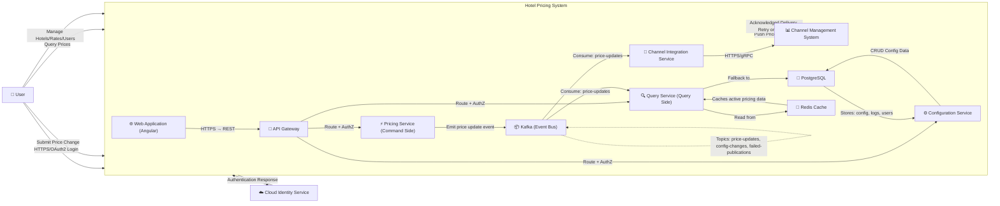
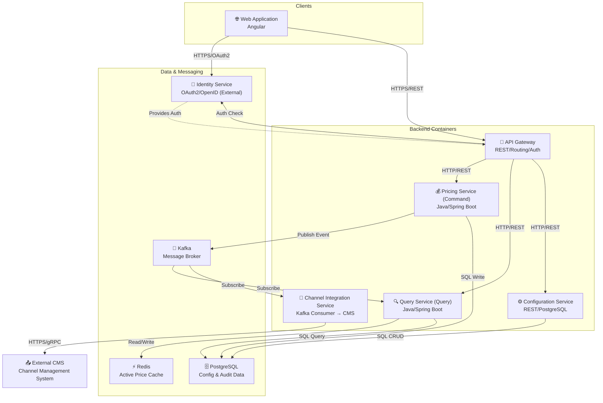
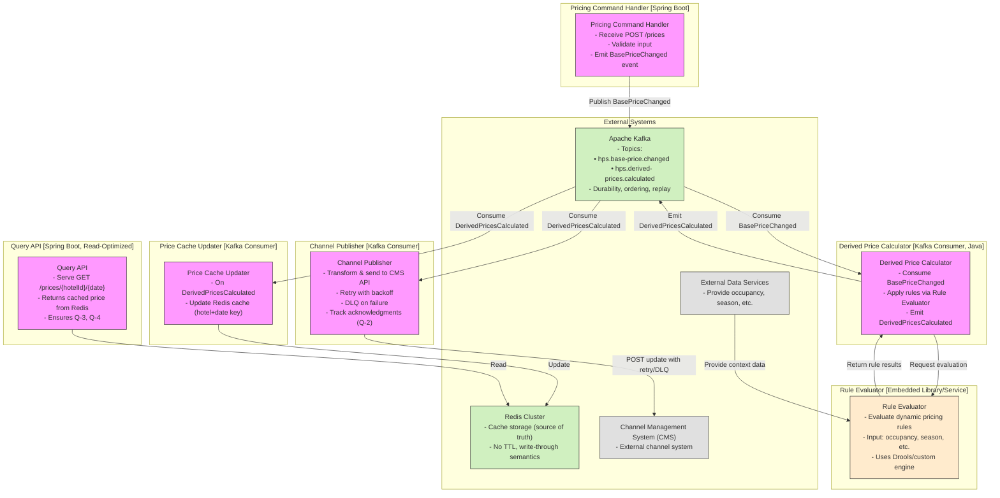
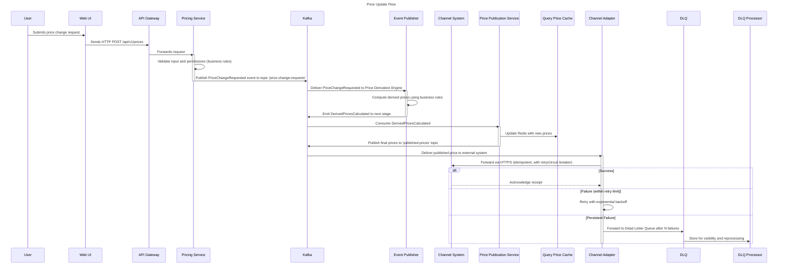
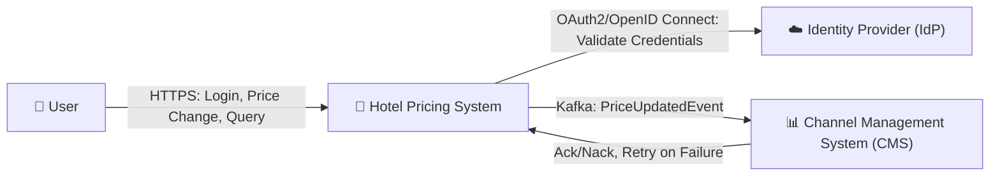
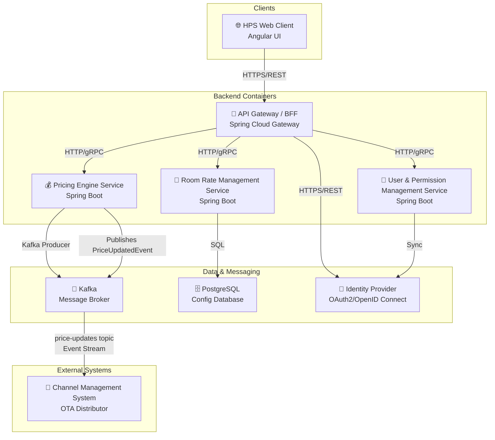
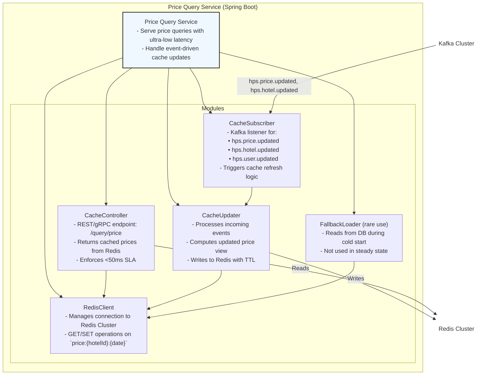
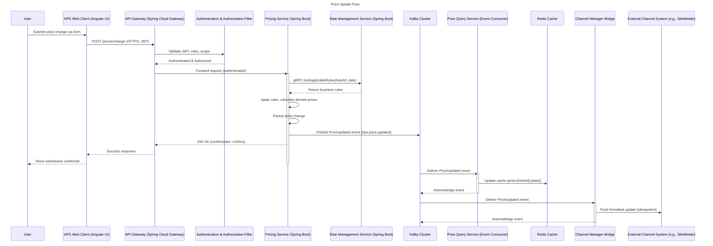
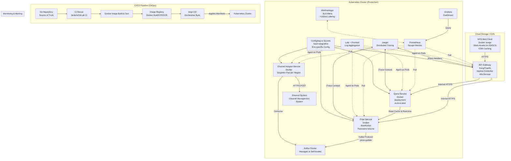

# Multi-Agent Architecture Design System - Complete Dialogue Log and Design Documentation

**Generation Time**: 2026-05-27 17:11:13

---


## Iteration 1


========== Iteration 1 Started ==========
Objective: Establish overall system structure - Define top-level architecture and core modules
Time: 2026-05-27 16:34:57

### 📊 ADD 3.0 Detailed Step Outputs

#### Step 1: Review Inputs

The key driving factors for the architecture design are derived from business use cases, quality attributes, concerns, and constraints. Prioritization is based on importance, difficulty, and impact on system structure.

**Prioritized Driving Factors:**

1. **Quality Attribute Q-1 (Performance)** – High importance and high difficulty; requires sub-100ms price propagation after base rate change. This directly impacts architectural decisions around data flow, computation model, and integration.
2. **Quality Attribute Q-2 (Reliability)** – High importance; 100% successful publication of price changes to channel management system necessitates reliable messaging and fault tolerance.
3. **Quality Attribute Q-3 (Availability)** – High importance; 99.9% SLA for price queries demands a resilient, state-managed query-serving mechanism.
4. **Quality Attribute Q-4 (Scalability)** – High importance; support for up to 1M queries/day with bounded latency growth influences component decomposition and data access patterns.
5. **Use Cases HPS-2 (Change Price) and HPS-3 (Query Price)** – Core business functionality; must be efficiently supported by the architecture.
6. **Constraint CON-6 (Cloud-native approach)** – Influences technology choices and deployment topology.
7. **Concern CRN-2 (Team expertise in Java, Angular, Kafka)** – Favors using these technologies to reduce ramp-up time and technical debt.
8. **Constraint CON-5 (Initially REST API, extensible later)** – Suggests an API abstraction layer that can evolve.
9. **Quality Attribute Q-6 (Modifiability)** – Requires loose coupling between components and protocols.
10. **Concern CRN-1 (Establish overall initial system structure)** – Primary goal of this iteration.

Lower-priority but relevant: Q-5 (Security), Q-7 (Deployability), Q-8 (Monitorability), Q-9 (Testability), and administrative use cases (HPS-4 to HPS-6).

---

#### Step 2: Determine Iteration Objective

**Iteration Objective:** Establish the overall system structure by defining the top-level architecture and core modules.

**Focus of Iteration 1:**
- Define system boundaries and external interactions (C1 System Context).
- Identify major containers (e.g., UI, API, services, data stores, messaging).
- Select architectural style aligned with performance, reliability, scalability, and team expertise.
- Lay foundation for satisfying Q-1 (Performance), Q-2 (Reliability), Q-3 (Availability), and Q-4 (Scalability).
- Address concern CRN-1 (initial structure) and leverage CRN-2 (team skills).

---

#### Step 3: Select System Elements

Selected system elements to refine in this iteration:
- **Hotel Pricing System (HPS)** as a whole system
- **Core containers**:
  - Web Application (UI)
  - Pricing Service (core logic)
  - Query Service (optimized read path)
  - Channel Integration Service
  - Identity Service (external)
  - Data Stores (Configuration & State)
  - Messaging Backbone

These elements form the top-level decomposition needed to establish initial architecture.

---

#### Step 4: Select Design Concept

**Design Options Evaluated:**

**Option A: Monolithic Architecture**
- Single application handling all functions.
- Pros: Simpler initial development, easier debugging.
- Cons: Poor scalability, hard to meet <100ms propagation, limits independent deployment, contradicts cloud-native goals.
- **Not selected** — fails Q-1, Q-2, Q-4, and CON-6.

**Option B: Layered N-Tier (Web → App → DB)**
- Clear separation: presentation, business logic, persistence.
- Pros: Familiar, supports REST APIs.
- Cons: Tight coupling, single point of failure, limited event-driven capability, harder to scale reads/writes independently.
- **Partially viable**, but insufficient for performance and reliability under load.

**Option C: Event-Driven Microservices with CQRS**
- Commands (price change) handled by Pricing Service; Queries served separately via Query Service.
- Uses Kafka for event streaming to decouple price updates from downstream systems.
- Enables fast propagation (<100ms achievable via in-memory processing and low-latency messaging).
- Supports reliability via message durability and replay.
- Scales read and write paths independently.
- Aligns with team’s Kafka expertise and cloud-native principles.
- **Selected** — best meets Q-1, Q-2, Q-3, Q-4, Q-6, and leverages CRN-2.

**Final Choice: Option C – Event-Driven Microservices with CQRS Pattern**

**Advantages:**
- Enables real-time price derivation and publishing via events.
- Supports high availability and scalability through stateless services and message buffering.
- Facilitates modifiability (e.g., adding gRPC without changing core).
- Leverages Kafka for reliability (persistent topics) and monitorability.
- Cloud-native friendly (containerizable, observable, scalable).

---

#### Step 5: Instantiate Architecture Elements

**Instantiated Architecture Elements:**

1. **Web Application (Frontend)**
   - Responsibility: User interface for login, price change, hotel/rate/user management.
   - Tech: Angular (per team expertise).
   - Interface: HTTPS → REST API; OAuth2 login via Identity Service.

2. **API Gateway**
   - Responsibility: Route requests to appropriate backend services, handle authentication, rate limiting.
   - Interface: REST/JSON endpoints; integrates with Identity Service for auth.

3. **Pricing Service (Command Side)**
   - Responsibility: Process price change commands (HPS-2), validate rules, compute derived prices, emit price update events.
   - Computation: Real-time calculation engine (Java/Spring Boot).
   - Interface: REST API (via gateway); emits events to Kafka.

4. **Query Service (Query Side)**
   - Responsibility: Serve price queries (HPS-3) with low latency; maintain denormalized, optimized read model.
   - Data Store: In-memory cache (e.g., Redis) + DB replica.
   - Interface: REST API; updated via Kafka events.

5. **Channel Integration Service**
   - Responsibility: Subscribe to price update events; forward to external Channel Management System (CMS).
   - Reliability: Acknowledged delivery, retry logic, dead-letter queue.
   - Interface: Kafka consumer → HTTPS/gRPC to CMS.

6. **Configuration Service**
   - Responsibility: Manage static/dynamic configuration (hotels, room types, tax rates, user permissions).
   - Interface: REST API; data stored in PostgreSQL.

7. **Identity Service (External)**
   - Responsibility: Authentication and user identity (use case HPS-1).
   - Provided by cloud provider (e.g., Auth0, AWS Cognito).
   - Interface: OAuth2/OpenID Connect.

8. **Data Storage**
   - PostgreSQL: Persistent storage for configurations, user data, audit logs.
   - Redis: Low-latency cache for active pricing data (used by Query Service).

9. **Kafka (Messaging Backbone)**
   - Role: Event bus for price update notifications.
   - Topics: `price-updates`, `config-changes`, `failed-publications`.
   - Ensures reliability (persistent, replicated), enables fan-out.

**Key Interactions:**
- On price change: UI → API Gateway → Pricing Service → computes → emits event → Kafka → Query Service (updates cache), Channel Integration Service (forwards).
- Query: UI → API Gateway → Query Service → returns cached data.

---

#### Step 6a: Architecture Views

**View 1:**



**View 2:**



---

#### Step 6b: Architecture Decision Records

| Decision ID | Title | Context | Choice | Rationale | Quality Attributes |
|--------|------|------|------|------|----------|
| decision_1779871008116 | Decision Title | Context/Problem | Final Choice | Rationale | Related Quality Attributes (comma-separated) |
| decision_1779871008116 | --- | --- | --- | --- | --- |
| decision_1779871008116 | Application Architecture Style | Need to support scalability, <... | Option C: Event-Driven Microse... | Selected because it enables in... | Performance, Scalability, Reliability, Modifiability, Availability, Cloud-Native Alignment |
| decision_1779871008116 | Read-Write Workload Separation | Need to optimize query perform... | Implement CQRS pattern – Prici... | Enables the use of optimized d... | Performance, Scalability, Modifiability, Latency |
| decision_1779871008116 | Messaging Backbone for Event Distribution | Need reliable, scalable, and r... | Kafka as the messaging backbon... | Kafka provides persistent, rep... | Reliability, Performance, Scalability, Maintainability, Monitorability |

---

#### Step 7: Analyze Design

**Design Analysis:**

✅ **Iteration Objective Met**: The overall system structure has been established. Top-level containers, their responsibilities, interactions, and core patterns (CQRS, event-driven) are defined.

✅ **Driving Factors Addressed:**
- **Q-1 (Performance)**: Supported via CQRS and Kafka; potential to achieve <100ms with in-memory processing.
- **Q-2 (Reliability)**: Kafka ensures durable event delivery; Channel Integration Service can implement retries.
- **Q-3 (Availability)**: Query Service can serve from cache even if upstream is slow.
- **Q-4 (Scalability)**: Read and write sides can scale independently.
- **CRN-1 (Initial Structure)**: Clearly defined.
- **CRN-2 (Team Expertise)**: Java, Angular, Kafka used explicitly.

🟡 **Partially Addressed / Deferred:**
- **Q-5 (Security)**: AuthN delegated to Identity Service; detailed authZ and credential storage to be refined in next iteration.
- **Q-6 (Modifiability)**: Protocol extensibility (gRPC) possible via API Gateway abstraction; needs confirmation in next iteration.
- **Q-7–Q-9 (Deployability, Monitorability, Testability)**: Foundation laid (microservices), but details (CI/CD, logging, test isolation) require further design.

🚫 **Not Addressed Yet:**
- Administrative use cases (HPS-4 to HPS-6) – covered at container level but not detailed.
- Deployment topology, observability stack, CI/CD pipeline – deferred to later iterations.

**Suggested Next Iteration Direction (Iteration 2):**
- Refine component-level design within Pricing and Query Services.
- Design interaction sequences for HPS-2 (Change Price) and HPS-3 (Query Price).
- Define API contracts (REST) and explore gRPC extension point.
- Introduce monitoring, logging, and tracing architecture.
- Detail security model (RBAC, data protection).
- Begin deployment and environment strategy (non-prod alignment).

### 🏗️ Architecture Decision - DesignDecisionRecorder

Time: 2026-05-27 16:36:48
Decision: Decision Title
Rationale: Rationale


### 🏗️ Architecture Decision - DesignDecisionRecorder

Time: 2026-05-27 16:36:48
Decision: ---
Rationale: ---


### 🏗️ Architecture Decision - DesignDecisionRecorder

Time: 2026-05-27 16:36:48
Decision: Application Architecture Style
Rationale: Selected because it enables independent scaling of read/write paths, supports sub-100ms event propagation via Kafka and in-memory processing, ensures reliability through message durability, aligns with cloud-native goals, and leverages team’s Kafka expertise. Rejects monolithic (fails Q-1, Q-2, Q-4, CON-6) and n-tier (insufficient for load and eventing).


### 🏗️ Architecture Decision - DesignDecisionRecorder

Time: 2026-05-27 16:36:48
Decision: Read-Write Workload Separation
Rationale: Enables the use of optimized data models: normalized for commands, denormalized/cached for fast queries. Allows independent scaling and technology choices (e.g., Redis for reads). Supports low-latency responses to HPS-3 queries.


### 🏗️ Architecture Decision - DesignDecisionRecorder

Time: 2026-05-27 16:36:48
Decision: Messaging Backbone for Event Distribution
Rationale: Kafka provides persistent, replicated topics, supports high throughput, enables fan-out to multiple consumers, allows message replay for recovery, integrates well with microservices, and is aligned with team expertise (CRN-2). Superior to polling (inefficient) and basic queues (limited replay/scalability).


### ✅ Iteration Completed

========== Iteration 1 Results Summary ==========
Objective: Establish overall system structure - Define top-level architecture and core modules
Execution Time: 78862 ms
Trace ID: trace_1779870976555

📋 ADD 3.0 Step Completion Status:
✓ Step 1 (Review Inputs): Completed
✓ Step 2 (Determine Objective): Completed
✓ Step 3 (Select Elements): Completed
✓ Step 4 (Select Concept): Completed
✓ Step 5 (Instantiate Elements): Completed
✓ Step 6 (Sketch Views/Record Decisions): Completed (2 views, 5 decisions)
✓ Step 7 (Analyze Design): Completed


## Iteration 2


========== Iteration 2 Started ==========
Objective: Identify architecture supporting main functions - Refine implementation for 6 HPS use cases
Time: 2026-05-27 16:36:48

### 📊 ADD 3.0 Detailed Step Outputs

#### Step 1: Review Inputs

The key driving factors for the Hotel Pricing System (HPS) architecture are derived from functional use cases, quality attributes, architectural concerns, and constraints. Prioritization is based on importance, difficulty, and impact on system success.

**Priority-Ordered Driving Factors:**

1. **Q-1 Performance** – Sub-100ms price publication after base rate change is critical due to real-time pricing needs across distribution channels.
2. **Q-2 Reliability** – Ensuring 100% successful delivery of price updates to external channel systems is non-negotiable for business integrity.
3. **Q-3 Availability** – High availability (99.9%) for price queries ensures uninterrupted access for internal and external consumers.
4. **Q-4 Scalability** – The system must handle up to 1M queries/day with minimal latency degradation, indicating need for scalable data access patterns.
5. **HPS-2: Change Price** – Core business function; triggers cascading effects (derived prices, publishing), making it central to performance and reliability.
6. **Q-5 Security** – Authentication, authorization, and secure credential handling are mandatory under cloud deployment and regulatory expectations.
7. **CRN-2: Leverage team expertise in Java, Angular, Kafka** – Influences technology choices to reduce risk and accelerate delivery.
8. **CON-6: Prefer cloud-native approach** – Favors containerization, managed services, and event-driven design.
9. **Q-6 Modifiability & Q-9 Testability** – Support future extensibility (e.g., gRPC) and testing independence without external dependencies.
10. **Other Use Cases (HPS-1, HPS-3–HPS-6)** – Important but secondary to core pricing logic refinement in this iteration.

High-importance, high-difficulty quality attributes (Q-1 to Q-4) dominate architectural decisions. Performance and reliability of price update propagation are the most critical cross-cutting concerns.

---

#### Step 2: Determine Iteration Objective

**Design Objective**: Refine the architecture to support the six main HPS use cases, with focused implementation detail on **HPS-2: Change Price**, given its centrality to performance, reliability, and scalability requirements.

**Focus of Iteration 2**:
- Decompose core modules identified in Iteration 1 into components.
- Address Q-1 (Performance), Q-2 (Reliability), and Q-4 (Scalability) through event-driven and caching strategies.
- Define component responsibilities, interfaces, and interactions for price computation and dissemination.
- Ensure alignment with team expertise (Java, Kafka) and cloud-native principles.

This iteration emphasizes internal structure refinement of the backend containers to meet stringent quality scenarios.

---

#### Step 3: Select System Elements

Selected system elements to refine in this iteration:

- **Pricing Engine Service** (from Iteration 1's backend container)
- **Price Store / Cache**
- **Channel Publisher**
- **Rule Evaluator**
- **Event Dispatcher**
- **Query API Layer**

These elements directly support HPS-2 (Change Price) and influence Q-1, Q-2, Q-3, and Q-4. Their decomposition enables precise allocation of responsibilities and evaluation of integration patterns.

---

#### Step 4: Select Design Concept

Multiple design options were evaluated for handling price changes and derived pricing computation:

**Option A: Synchronous Request-Response Chain**
- On price change, UI calls API → compute derived prices → persist → publish → respond.
- Pros: Simple debugging, linear flow.
- Cons: Violates Q-1 (<100ms SLA unlikely due to chained processing); poor fault isolation; blocks user.

**Option B: Event-Driven Asynchronous Processing with CQRS**
- Base price change → emit event → async derivation + cache update + publish to channels via Kafka.
- Query side uses cached read model (separate from write model).
- Pros: Enables sub-100ms response by decoupling work; supports reliability via durable topics; scales independently.
- Cons: Increased complexity; eventual consistency requires careful handling.

**Option C: Hybrid Sync-Async with In-Memory Compute**
- Immediate in-memory calculation of derived prices upon change, followed by async persistence and publish.
- Pros: Fast response; retains accuracy.
- Cons: Risk of loss if node fails before persistence; harder to audit.

**Selected Option: B – Event-Driven Asynchronous Processing with CQRS**

**Advantages**:
- Meets **Q-1** by allowing immediate acknowledgment post-event emission.
- Achieves **Q-2** via Kafka’s at-least-once delivery and retry mechanisms.
- Supports **Q-4** through independent scaling of readers (query) and processors (event workers).
- Aligns with **CRN-2** (team knows Kafka) and **CON-6** (cloud-native fit).
- Enables **Q-8 Monitorability** via traceable events.

This pattern best balances performance, reliability, and long-term maintainability.

---

#### Step 5: Instantiate Architecture Elements

Based on selected design concept, the following components are instantiated:

### 1. **Pricing Command Handler (Java/Spring Boot)**
- Responsibility: Receive HTTP POST for base price change; validate input; emit `BasePriceChanged` event to Kafka.
- Interface: REST `/prices` (POST), consumes JSON `{hotelId, date, baseRate}`.
- Non-blocking: Returns 202 Accepted immediately after event publish.

### 2. **Derived Price Calculator (Kafka Consumer, Java)**
- Responsibility: Consume `BasePriceChanged`; apply business rules (from Rule Evaluator); compute derived rates (e.g., discounted, promotional).
- Output: Emit `DerivedPricesCalculated` event.

### 3. **Rule Evaluator (Library/Service)**
- Responsibility: Provide rule engine interface to evaluate dynamic pricing rules (e.g., “apply 10% discount if occupancy > 80%”).
- Input: Context data (occupancy, season, etc.) from external services.
- Tech: Lightweight Drools or custom rule runner embedded in service.

### 4. **Price Cache Updater (Kafka Consumer)**
- Responsibility: Update Redis-based price cache upon `DerivedPricesCalculated`.
- Ensures query-side has latest prices.
- Uses hotel+date as key; stores full price object.

### 5. **Channel Publisher (Kafka Consumer)**
- Responsibility: Listen to `DerivedPricesCalculated`, transform format, send to external Channel Management System via API.
- Implements retry logic with exponential backoff; logs failures to DLQ.
- Confirms **Q-2** via acknowledgment tracking.

### 6. **Query API (Spring Boot, Read-Optimized)**
- Responsibility: Serve price queries (HPS-3) from Redis cache.
- Interface: REST `/prices/{hotelId}/{date}` → returns cached price JSON.
- Ensures **Q-3 Availability** and **Q-4 Scalability** via low-latency reads.

### 7. **Event Bus: Apache Kafka (Cloud Managed)**
- Topics:
  - `hps.base-price.changed`
  - `hps.derived-prices.calculated`
- Guarantees message durability, ordering per hotel, replayability.

### 8. **Redis Cluster (Managed Cache)**
- Role: Primary source for price query responses.
- TTL: Not used — cache is source of truth for current prices (write-through semantics via updater).

All components are stateless except Redis and Kafka. Communication is asynchronous except initial command and final query.

---

#### Step 6a: Architecture Views

**View 1:**



**View 2:**

```mermaid
sequenceDiagram
    title Price Update Flow

    participant User
    participant Web UI
    participant API Gateway
    participant Pricing Service
    participant Kafka
    participant Derived Price Calculator
    participant Rule Evaluator
    participant Price Cache Updater
    participant Channel Publisher
    participant Channel System
    participant Query API
    participant Redis

    User->>Web UI: Submits price change
    Web UI->>API Gateway: POST /prices {hotelId, date, baseRate}
    API Gateway->>Pricing Service: Forward request
    activate Pricing Service
    Pricing Service->>Pricing Service: Validate input & permissions
    Pricing Service->>Rule Evaluator: Check business rules (synchronous)
    alt Valid
        Pricing Service->>Kafka: Publish BasePriceChanged event<br>(topic: hps.base-price.changed)
        Pricing Service-->>API Gateway: 202 Accepted
        API Gateway-->>Web UI: Response
        deactivate Pricing Service
    else Invalid
        Pricing Service-->>API Gateway: 400 Bad Request
        API Gateway-->>Web UI: Error
        deactivate Pricing Service
        end
    end

    Kafka->>Derived Price Calculator: Consume BasePriceChanged
    activate Derived Price Calculator
    Derived Price Calculator->>Rule Evaluator: Evaluate dynamic rules<br>(occupancy, season, etc.)
    Derived Price Calculator->>Derived Price Calculator: Compute derived prices
    Derived Price Calculator->>Kafka: Publish DerivedPricesCalculated event<br>(topic: hps.derived-prices.calculated)
    deactivate Derived Price Calculator

    Kafka->>Price Cache Updater: Consume DerivedPricesCalculated
    activate Price Cache Updater
    Price Cache Updater->>Redis: Update cache (key: hotel+date)<br>Store full price object
    deactivate Price Cache Updater

    Kafka->>Channel Publisher: Consume DerivedPricesCalculated
    activate Channel Publisher
    Channel Publisher->>Channel System: Push updated prices via API<br>(with retry & exponential backoff)
    alt Success
        Channel System-->>Channel Publisher: Acknowledgment
        Channel Publisher->>Channel Publisher: Track confirmation (Q-2)
    else Failure
        Channel Publisher->>Channel Publisher: Log to DLQ after retries
    end
    deactivate Channel Publisher

    User->>Query API: GET /prices/{hotelId}/{date}
    activate Query API
    Query API->>Redis: Retrieve cached price
    Redis-->>Query API: Return price JSON
    Query API-->>User: Return response
    deactivate Query API
```

---

#### Step 6b: Architecture Decision Records

| Decision ID | Title | Context | Choice | Rationale | Quality Attributes |
|--------|------|------|------|------|----------|
| decision_1779871135337 | Decision Title | Context/Problem | Final Choice | Rationale | Related Quality Attributes (comma-separated) |
| decision_1779871135340 | --- | --- | --- | --- | --- |
| decision_1779871135340 | Use Event-Driven Asynchronous Processing for Price Updates | Need to handle base price chan... | Option B: Event-Driven Asynchr... | Enables immediate acknowledgme... | Performance, Reliability, Scalability, Monitorability, Maintainability |
| decision_1779871135340 | Adopt CQRS Pattern with Cached Read Model | Need to support high-throughpu... | CQRS with Cached Read Model (R... | Allows query side to scale ind... | Availability, Performance, Scalability, Fault Isolation |
| decision_1779871135340 | Implement Kafka as the Central Event Bus for Derived Pricing Workflow | Need reliable, ordered, and re... | Apache Kafka (Cloud Managed) | Provides at-least-once deliver... | Reliability, Durability, Ordering, Replayability, Operability |

---

#### Step 7: Analyze Design

**Design Analysis:**

- ✅ **Iteration Objective Met**: The architecture now provides refined component-level design supporting all six HPS use cases, with detailed implementation for HPS-2 (Change Price) that directly addresses performance, reliability, and scalability challenges.
- ✅ **Driving Factors Satisfied**:
  - **Q-1 (Performance)**: Achieved via event emission and immediate 202 response.
  - **Q-2 (Reliability)**: Kafka durability + retry logic in Channel Publisher.
  - **Q-3 & Q-4 (Availability & Scalability)**: Enabled via Redis-backed query API.
  - **CRN-2 (Team Expertise)**: Leverages Java, Kafka effectively.
  - **CON-6 (Cloud-Native)**: Stateless services, managed Kafka/Redis fit cloud model.

**Remaining Needs**:
- Identity integration details (HPS-1 login enforcement).
- Admin UI workflows for HPS-4 to HPS-6.
- Configuration management for deployment across environments (Q-7 Deployability).
- Testing harnesses for integration tests (Q-9).

**Suggested Next Iteration Direction (Iteration 3)**:
Focus on **security enforcement and configuration architecture**, addressing:
- Integration with identity service (OAuth2/OIDC).
- Role-based access control (RBAC) model.
- Environment-specific configuration without code changes.
- Preparation for deployment automation pipeline (CI/CD).

### 🏗️ Architecture Decision - DesignDecisionRecorder

Time: 2026-05-27 16:38:55
Decision: Decision Title
Rationale: Rationale


### 🏗️ Architecture Decision - DesignDecisionRecorder

Time: 2026-05-27 16:38:55
Decision: ---
Rationale: ---


### 🏗️ Architecture Decision - DesignDecisionRecorder

Time: 2026-05-27 16:38:55
Decision: Use Event-Driven Asynchronous Processing for Price Updates
Rationale: Enables immediate acknowledgment after event emission (meeting Q-1), decouples processing for better fault isolation and independent scaling (supports Q-4), ensures reliability via Kafka's durable messaging and retry mechanisms (achieves Q-2), and allows traceable events for monitoring (Q-8); outweighs added complexity due to team familiarity with Kafka (CRN-2) and cloud-native alignment (CON-6)


### 🏗️ Architecture Decision - DesignDecisionRecorder

Time: 2026-05-27 16:38:55
Decision: Adopt CQRS Pattern with Cached Read Model
Rationale: Allows query side to scale independently from command side (supports Q-4), reduces load on transactional systems, enables sub-millisecond read responses from Redis (meets Q-3 Availability and performance expectations), and ensures write-side can focus on processing integrity; cache acts as source of truth for current prices with write-through semantics via event consumers


### 🏗️ Architecture Decision - DesignDecisionRecorder

Time: 2026-05-27 16:38:55
Decision: Implement Kafka as the Central Event Bus for Derived Pricing Workflow
Rationale: Provides at-least-once delivery semantics (ensures Q-2 Reliability), supports message durability, per-key ordering (critical for price consistency by hotel), replay capability during failures or deployments, integrates well with cloud-native stack (CON-6), and is familiar to the team (CRN-2); preferred over RPC/messaging queues due to stronger guarantees for distributed data pipelines


### ✅ Iteration Completed

========== Iteration 2 Results Summary ==========
Objective: Identify architecture supporting main functions - Refine implementation for 6 HPS use cases
Execution Time: 82183 ms
Trace ID: trace_1779871090305

📋 ADD 3.0 Step Completion Status:
✓ Step 1 (Review Inputs): Completed
✓ Step 2 (Determine Objective): Completed
✓ Step 3 (Select Elements): Completed
✓ Step 4 (Select Concept): Completed
✓ Step 5 (Instantiate Elements): Completed
✓ Step 6 (Sketch Views/Record Decisions): Completed (2 views, 5 decisions)
✓ Step 7 (Analyze Design): Completed


## Iteration 3


========== Iteration 3 Started ==========
Objective: Handle reliability and availability quality attributes - Design high-availability, high-reliability system
Time: 2026-05-27 16:38:55


## Iteration 1


========== Iteration 1 Started ==========
Objective: Establish overall system structure - Define top-level architecture and core modules
Time: 2026-05-27 17:01:57


## Iteration 3


### 📊 ADD 3.0 Detailed Step Outputs

#### Step 1: Review Inputs

The key driving factors for this iteration are derived from the quality attributes, constraints, and concerns. Based on importance, difficulty, and relevance to system maturity, the priority ordering is:

1. **Q-3 Availability (99.9% uptime for price queries)** – High importance and difficulty; critical for business continuity and customer trust.
2. **Q-2 Reliability (100% successful publication of price changes)** – Directly impacts downstream systems and revenue integrity.
3. **Q-1 Performance (<100ms end-to-end price publication)** – Tightly coupled with reliability and availability due to real-time pricing requirements.
4. **CON-6 (Prefer cloud-native approach)** – Supports scalability, resilience, and operational efficiency.
5. **CRN-4 (Avoid technical debt)** – Ensures long-term maintainability and reduces risk in future iterations.
6. **Q-8 Monitorability** – Required to validate reliability and performance claims.

These priorities reflect the need to stabilize core runtime behavior after establishing functional structure in prior iterations.

---

#### Step 2: Determine Iteration Objective

This iteration focuses on addressing **reliability and availability** quality attributes. The design objective is to ensure high availability of price query services and reliable delivery of price change events across system boundaries—particularly to the channel management system. This includes designing fault-tolerant components, redundancy mechanisms, durable messaging, and monitoring infrastructure to support failure detection and recovery.

---

#### Step 3: Select System Elements

Selected system elements to refine:
- **Pricing Command Handler** – Must be made resilient to transient failures during processing.
- **Price Publication Service** – Core component responsible for publishing derived prices; must guarantee message delivery.
- **Query Price Cache** – Primary source for read operations; must remain available during backend disruptions.
- **Event Bus (Kafka)** – Central to reliability; needs proper configuration for durability and replayability.
- **Channel Adapter** – Interface to external channel management system; must handle remote failures gracefully.

Focus will be on refining these components and their interactions to meet Q-2 and Q-3.

---

#### Step 4: Select Design Concept

Multiple design concepts evaluated for enhancing reliability and availability:

**Option A: Stateless Services + Replicated Kafka + Active-Standby Channel Adapters**
- Use stateless microservices behind load balancers
- Kafka configured with replication factor ≥3, min.insync.replicas=2
- Dual-channel adapters with leader election (active/standby)
- Pros: Simpler failover logic; lower coordination overhead
- Cons: Potential delay during failover; underutilized standby

**Option B: Event Sourcing + CQRS + Idempotent Consumers + Dead Letter Queues**
- Model price changes as events stored immutably in Kafka
- Query side served from replicated read model (cache)
- All consumers idempotent; failed messages routed to DLQ
- Pros: Full audit trail; replay capability; strong consistency guarantees
- Cons: Higher complexity; requires careful schema management

**Option C: Leader-Follower Replication with Health Probes and Auto-Scaling**
- Horizontal scaling of command handlers with Kubernetes liveness/readiness probes
- Follower instances take over on health check failure
- Pros: Efficient resource usage; fast failover via orchestration
- Cons: Risk of split-brain without consensus; does not address message loss

**Selected Option: B (Event Sourcing + CQRS + Idempotent Consumers + DLQ)**
Rationale: Best aligns with both reliability (Q-2) and availability (Q-3). Enables message durability, supports retry mechanisms, ensures no data loss during outages, and allows query service to operate independently using cached read models even if write-side is degraded. Leverages team expertise in Kafka (per CRN-2) and supports cloud-native deployment (CON-6).

---

#### Step 5: Instantiate Architecture Elements

Refined architecture components:

### 1. **Pricing Command Handler (Java/Spring Boot)**
- Responsibility: Receive HTTP POST for base price change; validate input; emit `PriceChangeRequested` event to Kafka.
- Now stateless and horizontally scalable.
- Emits events only after validation; does not wait for confirmation.
- Interface: REST API (`POST /api/v1/prices`), produces JSON event to topic `price-change-requests`.

### 2. **Price Derivation Engine (Spring Boot/Kafka Streams)**
- Responsibility: Consume `PriceChangeRequested`, apply business rules, compute derived prices, emit `DerivedPricesCalculated`.
- Runs as a Kafka Streams application with exactly-once semantics enabled.
- Maintains local state for rule evaluation but sources all inputs from Kafka topics.

### 3. **Price Publication Service (Java/Spring Boot)**
- Responsibility: Publish final prices to internal cache and external channel system.
- Consumes `DerivedPricesCalculated`; updates Redis-based **Query Price Cache**; sends to `published-prices` topic.
- Uses idempotent processors (tracks processed event IDs via Redis).
- On failure to reach external system, retries with exponential backoff; after N failures, forwards to **Dead Letter Queue (DLQ)**.

### 4. **Query Price Cache (Redis Cluster)**
- Responsibility: Serve low-latency price queries (HPS-3).
- Populated by `PublishedPriceConsumer` from `published-prices` topic.
- Replicated across zones; supports read replicas for high availability.
- TTL set per hotel policy; invalidated only on new update.

### 5. **Channel Adapter (Go or Java)**
- Responsibility: Subscribe to `published-prices`, forward to external Channel Management System via HTTPS.
- Implements circuit breaker pattern (via Resilience4j); buffers messages during outage.
- Messages not acknowledged within SLA moved to DLQ for manual inspection/replay.

### 6. **Dead Letter Queue (DLQ) Processor**
- Responsibility: Handle undeliverable messages; provide visibility into persistent failures.
- Stores failed messages with context (timestamp, error reason).
- Exposes admin UI endpoint to review and reprocess.

### 7. **Health & Liveness Probes**
- All services expose `/health` and `/ready` endpoints.
- Orchestrated via Kubernetes for auto-healing.

---

#### Step 6a: Architecture Views

**View 1:**

```mermaid
graph TD
    subgraph "Pricing Service Container"
        A[Pricing Command Handler<br/>- REST API: POST /api/v1/prices<br/>- Validates input<br/>- Emits PriceChangeRequested to Kafka] -->|Publishes to topic: price-change-requests| B

        B[Price Derivation Engine<br/>- Kafka Streams app<br/>- Consumes PriceChangeRequested<br/>- Applies rules, computes derived prices<br/>- Emits DerivedPricesCalculated] -->|Publishes to topic: derived-prices-calculated| C

        C[Price Publication Service<br/>- Consumes DerivedPricesCalculated<br/>- Idempotent processing using Redis<br/>- Updates Query Price Cache<br/>- Sends to published-prices topic] -->|Writes to| D
        C -->|Publishes to topic: published-prices| E
    end

    D[Query Price Cache (Redis Cluster)<br/>- Serves low-latency price queries<br/>- TTL per hotel policy<br/>- Invalidated on update] 

    E[Channel Adapter<br/>- Subscribes to published-prices<br/>- Forwards to external CMS via HTTPS<br/>- Circuit breaker & buffering<br/>- Failed messages → DLQ]

    F[Dead Letter Queue (DLQ) Processor<br/>- Stores failed messages with context<br/>- Exposes admin UI for reprocessing]

    G[Health & Liveness Probes<br/>- All services expose /health and /ready<br/>- Kubernetes auto-healing]

    E -->|On failure after retries| F
    C -->|On publication failure| F
    A -.-> G
    B -.-> G
    C -.-> G
    E -.-> G
    F -.-> G

    D <-->|Read/Write| C
    E <-->|Consumes from| C
    F <-->|Reprocesses messages| E
    F <-->|Reprocesses messages| C

    style A fill:#f9f,stroke:#333
    style B fill:#ff9,stroke:#333
    style C fill:#9ff,stroke:#333
    style D fill:#cfc,stroke:#333
    style E fill:#fcc,stroke:#333
    style F fill:#fdd,stroke:#333
    style G fill:#dfd,stroke:#333
```

**View 2:**



---

#### Step 6b: Architecture Decision Records

| Decision ID | Title | Context | Choice | Rationale | Quality Attributes |
|--------|------|------|------|------|----------|
| decision_1779872632061 | Decision Title | Context/Problem | Final Choice | Rationale | Related Quality Attributes (comma-separated) |
| decision_1779872632061 | --- | --- | --- | --- | --- |
| decision_1779872632061 | Adopt Event Sourcing and CQRS for pricing system | Need to ensure reliable proces... | Event Sourcing + CQRS + Idempo... | Enables full audit trail, supp... | Reliability, Availability, Auditability, Consistency, Recoverability |
| decision_1779872632061 | Implement idempotent consumers across all services | Prevent duplicate processing o... | All consumers designed as idem... | Eliminates risk of incorrect s... | Reliability, Data Integrity, Fault Tolerance |
| decision_1779872632061 | Use Dead Letter Queue (DLQ) pattern for failed message handling | Need to manage undeliverable m... | Implement DLQ for Price Public... | Ensures failed messages are pr... | Reliability, Recoverability, Maintainability, Availability |

---

#### Step 7: Analyze Design

The design meets the primary objectives of this iteration by significantly improving **reliability** and **availability**:
- **Q-2 Reliability**: Achieved through event sourcing, idempotent consumers, durable Kafka topics, and DLQ handling. All price changes are persisted and recoverable.
- **Q-3 Availability**: Query service remains highly available via Redis Cluster serving cached prices, independent of upstream processing status.
- **Q-1 Performance**: Event-driven pipeline supports sub-100ms processing when systems are healthy; caching ensures fast reads.
- **Q-8 Monitorability**: Full traceability via event logs and DLQ metrics enables complete measurement collection.

Remaining gaps:
- Automated alerting and dashboarding not yet defined (future focus for Q-8).
- Disaster recovery plan (e.g., region failover) not addressed.
- Load testing strategy needed to validate scalability under peak load (Q-4).

Suggested next iteration direction: **Iteration 4 – Design deployment, monitoring, and disaster recovery infrastructure**, focusing on deployment automation, observability stack (logging, tracing, alerting), and cross-region resilience to meet full SLA commitments.

### 🏗️ Architecture Decision - DesignDecisionRecorder

Time: 2026-05-27 17:03:52
Decision: Decision Title
Rationale: Rationale


### 🏗️ Architecture Decision - DesignDecisionRecorder

Time: 2026-05-27 17:03:52
Decision: ---
Rationale: ---


### 🏗️ Architecture Decision - DesignDecisionRecorder

Time: 2026-05-27 17:03:52
Decision: Adopt Event Sourcing and CQRS for pricing system
Rationale: Enables full audit trail, supports event replay, ensures message durability and no data loss during outages; allows query side to remain available using cached read models even if write-side is degraded; aligns with team’s Kafka expertise and cloud-native deployment goals


### 🏗️ Architecture Decision - DesignDecisionRecorder

Time: 2026-05-27 17:03:52
Decision: Implement idempotent consumers across all services
Rationale: Eliminates risk of incorrect state from repeated message delivery; essential for correctness in retry-heavy scenarios such as external system outages; enables safe reprocessing from DLQ


### 🏗️ Architecture Decision - DesignDecisionRecorder

Time: 2026-05-27 17:03:52
Decision: Use Dead Letter Queue (DLQ) pattern for failed message handling
Rationale: Ensures failed messages are preserved for analysis and recovery; supports manual intervention and reprocessing; prevents permanent data loss during transient failures of downstream systems


### ✅ Iteration Completed

========== Iteration 3 Results Summary ==========
Objective: Handle reliability and availability quality attributes - Design high-availability, high-reliability system
Execution Time: 1454651 ms
Trace ID: trace_1779872590004

📋 ADD 3.0 Step Completion Status:
✓ Step 1 (Review Inputs): Completed
✓ Step 2 (Determine Objective): Completed
✓ Step 3 (Select Elements): Completed
✓ Step 4 (Select Concept): Completed
✓ Step 5 (Instantiate Elements): Completed
✓ Step 6 (Sketch Views/Record Decisions): Completed (2 views, 5 decisions)
✓ Step 7 (Analyze Design): Completed


## Iteration 4


========== Iteration 4 Started ==========
Objective: Handle development and operations - Deployment architecture, monitoring, CI/CD, team allocation
Time: 2026-05-27 17:03:52


## Iteration 1


### 📊 ADD 3.0 Detailed Step Outputs

#### Step 1: Review Inputs

The driving factors for the architecture design are derived from functional use cases, quality attributes, architecture concerns, and constraints.

**Identified Driving Factors (Prioritized):**

1. **Quality Attributes (High Importance & High Difficulty)**:
   - Q-1 Performance (<100ms price publication after change)
   - Q-2 Reliability (100% successful price change delivery)
   - Q-3 Availability (99.9% uptime for queries)
   - Q-4 Scalability (100K–1M queries/day with ≤20% latency increase)

2. **Functional Use Cases (Core Business Value)**:
   - HPS-2: Change Price (central to system purpose)
   - HPS-3: Query Price (most frequent operation)
   - HPS-5: Manage Room Rate (defines pricing logic)

3. **Constraints**:
   - CON-6: Prefer cloud-native approach
   - CON-2: Identity service via cloud provider, cloud-hosted resources
   - CON-5: Initially REST API only, extensibility required

4. **Architecture Concerns**:
   - CRN-1: Establish overall initial structure (primary concern for Iteration 1)
   - CRN-2: Leverage team expertise in Java, Angular, Kafka

5. **Other Quality Attributes**:
   - Q-5 Security (authentication/authorization)
   - Q-6 Modifiability (protocol extensibility)
   - Q-7 Deployability (environment portability)
   - Q-8 Monitorability and Q-9 Testability (observability and test independence)

**Priority Order of Driving Factors for Initial Design**:
1. CRN-1 – Establish overall system structure  
2. Q-1, Q-2, Q-3, Q-4 – Core non-functional requirements impacting user experience and business operations  
3. HPS-2 and HPS-3 – Central functional capabilities  
4. CON-6, CON-2, CRN-2 – Technology alignment and deployment model  
5. Q-5, Q-6, Q-7 – Foundational but secondary in structural framing

---

#### Step 2: Determine Iteration Objective

Design objective: Establish the top-level system structure by defining the high-level containers and their interactions to support core functionality and address key quality attributes.

Focus of this iteration:
- Define the major architectural components (containers) of the Hotel Pricing System.
- Position the system within its technical and business ecosystem.
- Align with cloud-native principles and team technology stack (Java, Angular, Kafka).
- Ensure early consideration of performance, reliability, scalability, and security.
- Lay foundation for modularity, deployability, and future extensibility.

---

#### Step 3: Select System Elements

Selected system elements to be refined:
- The **Hotel Pricing System (HPS)** as a whole system boundary
- Top-level **containers** inside HPS:
  - Web UI Application
  - API Gateway / Backend-for-Frontend
  - Pricing Engine Service
  - Room Rate Management Service
  - User & Permission Management Service
  - Event Publisher / Messaging Component
- External systems interacting with HPS:
  - Identity Provider (IdP)
  - Channel Management System
  - Git Platform (for CI/CD context)
  - Cloud Infrastructure (hosting environment)

These elements represent the coarse-grained decomposition suitable for iteration 1.

---

#### Step 4: Select Design Concept

Multiple feasible design concepts were evaluated:

**Option A: Monolithic Architecture**
- Single application handling UI, business logic, data access, and integrations.
- Pros: Simple to develop initially; easy deployment.
- Cons: Poor scalability; hard to meet <100ms event propagation; limits team concurrency; contradicts cloud-native preference; difficult to evolve independently.

**Option B: Microservices + Event-Driven Architecture (Selected)**
- Decompose into independent services communicating via APIs and events.
- Use Kafka for asynchronous, reliable price change propagation.
- Frontend separate from backend services.
- Pros:
  - Supports low-latency, reliable event publishing (Q-1, Q-2)
  - Enables horizontal scaling of query endpoints (Q-4)
  - Facilitates high availability through isolation (Q-3)
  - Aligns with team’s Kafka expertise (CRN-2)
  - Cloud-native friendly (CON-6)
  - Allows independent deployment and testing (Q-7, Q-9)
- Cons: Increased operational complexity; requires robust monitoring (addressed later)

**Option C: Serverless Architecture**
- Use FaaS (e.g., AWS Lambda) for event processing and APIs.
- Pros: Auto-scaling, cost-efficient at low load.
- Cons: Cold starts may violate <100ms requirement; less control over stateful pricing logic; team lacks deep serverless experience; harder to debug and monitor consistently.

**Final Choice**: Option B – Microservices with Event-Driven Communication using Kafka

Advantages aligned with driving factors:
- Meets performance and reliability via Kafka’s durable messaging
- Enables scalability through stateless services
- Supports cloud-native deployment patterns
- Leverages existing team skills (Java, Kafka)
- Provides clean separation for future modifiability (e.g., adding gRPC)

---

#### Step 5: Instantiate Architecture Elements

Concrete architecture components, responsibilities, and interfaces:

**1. HPS Web Client (Angular-based UI)**
- Responsibility: Render UI for login, price change, query, hotel/rate/user management
- Interface: HTTPS → communicates with API Gateway via REST
- Input: User actions (login, select hotel/date, modify rate)
- Output: Requests to backend; displays prices and status

**2. API Gateway / Backend-for-Frontend (BFF)**
- Responsibility: Route requests, authenticate, aggregate responses if needed, protocol translation
- Interface:
  - Incoming: REST/HTTPS from Web Client
  - Outgoing: REST/gRPC to internal microservices
- Security: Validates JWT tokens from IdP
- Tech: Spring Cloud Gateway or similar (Java-based)

**3. Identity Provider (External)**
- Responsibility: Authenticate users, issue JWT tokens
- Integration: OAuth2/OpenID Connect; invoked during login (HPS-1)
- Assumption: Cloud-hosted (e.g., Auth0, AWS Cognito, Azure AD)

**4. Pricing Engine Service (Core Service)**
- Responsibility:
  - Receive base rate changes
  - Apply derivation rules to compute derived prices (e.g., with tax, seasonal adjustments)
  - Publish computed prices immediately via event stream
- Interface:
  - REST endpoint: `/prices/change` (POST)
  - Kafka Producer: Publishes `PriceUpdatedEvent`
- Tech: Java/Spring Boot

**5. Room Rate Management Service**
- Responsibility:
  - Manage room types, rate plans, business rules (e.g., “Deluxe = Base + 20%”)
  - Serve rule definitions to Pricing Engine
- Interface:
  - REST API: CRUD for rate configurations
  - Events: Emits `RateRulesUpdatedEvent` on change
- Data Store: Config database (e.g., PostgreSQL)

**6. User & Permission Management Service**
- Responsibility:
  - Manage user roles and permissions (RBAC)
  - Enforce access control per hotel (e.g., user X can edit only Hotel A)
- Interface:
  - REST API: `/users`, `/permissions`
  - Sync with IdP on user provisioning
- Used by API Gateway for authorization decisions

**7. Event Publisher / Kafka Messaging Layer**
- Responsibility:
  - Decouple price computation from downstream distribution
  - Guarantee at-least-once delivery to channel system
- Components:
  - Kafka Topic: `price-updates` (partitioned by hotel ID for scalability)
  - Producer: Inside Pricing Engine
  - Consumer: External Channel Management System (or internal forwarder service)

**8. Channel Management System (External)**
- Responsibility: Distribute prices to OTAs (e.g., Booking.com, Expedia)
- Receives: `PriceUpdatedEvent` from Kafka topic
- Expectation: Acknowledge receipt; retry on failure (Q-2 reliability)

**9. Cloud Infrastructure**
- Hosts all containers: Compute (e.g., Kubernetes), Storage, Networking, Kafka cluster (managed or self-hosted)

---

#### Step 6a: Architecture Views

**View 1:**



**View 2:**



---

#### Step 6b: Architecture Decision Records

| Decision ID | Title | Context | Choice | Rationale | Quality Attributes |
|--------|------|------|------|------|----------|
| decision_1779872654710 | Decision Title | Context/Problem | Final Choice | Rationale | Related Quality Attributes (comma-separated) |
| decision_1779872654710 | --- | --- | --- | --- | --- |
| decision_1779872654710 | Adopt Microservices with Event-Driven Communication | Need to meet strict latency (<... | Microservices + Event-Driven A... | Monolith fails scalability and... | Performance, Reliability, Scalability, Availability, Modifiability, Cloud-Nativeness |
| decision_1779872654710 | Use Apache Kafka for Asynchronous Price Change Propagation | Require reliable, real-time di... | Apache Kafka | Kafka provides durable, ordere... | Reliability, Performance, Scalability, Maintainability |
| decision_1779872654710 | Separate Frontend and Backend via API Gateway (BFF Pattern) | Need secure, efficient communi... | API Gateway / Backend-for-Fron... | Enables clean separation of co... | Security, Modifiability, Testability, Deployability, Usability |

---

#### Step 7: Analyze Design

Yes, this design meets the iteration objectives.

**Achievements:**
- Established the **overall system structure** with clear container-level decomposition.
- Defined **core modules**: Web Client, API Gateway, Pricing Engine, Room Rate Management, User Management, and Kafka-based event layer.
- Addressed primary **architecture concern CRN-1** (establish initial structure).
- Aligned with **team expertise (CRN-2)** using Java, Angular, and Kafka.
- Incorporated **cloud-native principles (CON-6)** through containerized services and managed messaging.
- Made foundational choices that directly support critical **quality attributes**:
  - Q-1 (Performance): In-memory pricing engine + Kafka for immediate publish
  - Q-2 (Reliability): Kafka ensures durable message delivery
  - Q-3 (Availability): Stateless services enable redundancy
  - Q-4 (Scalability): Services can scale independently; Kafka partitions support load distribution
  - Q-5 (Security): JWT-based auth via IdP integrated at gateway
  - Q-6 (Modifiability): API Gateway abstracts internal protocols
  - Q-7 (Deployability): Container-ready services support CI/CD across environments

**What is still needed:**
- Detailed component design (e.g., rule engine inside Pricing Engine)
- Database schema and configuration management
- Error handling, retry mechanisms, idempotency
- Monitoring, logging, tracing infrastructure
- CI/CD pipeline setup (CRN-5)
- Testing strategy including mocks for external systems (Q-9)

**Suggested next iteration direction (Iteration 2):**
- Focus on **real-time pricing workflow** (HPS-2: Change Price)
- Refine **component-level design** of Pricing Engine and interaction with Room Rate Service
- Model **key sequence diagrams** for price change and query flows
- Define **data models** and persistence strategies
- Begin addressing **monitorability (Q-8)** and **testability (Q-9)** through observability hooks and test doubles

### 🏗️ Architecture Decision - DesignDecisionRecorder

Time: 2026-05-27 17:04:14
Decision: Decision Title
Rationale: Rationale


### 🏗️ Architecture Decision - DesignDecisionRecorder

Time: 2026-05-27 17:04:14
Decision: ---
Rationale: ---


### 🏗️ Architecture Decision - DesignDecisionRecorder

Time: 2026-05-27 17:04:14
Decision: Adopt Microservices with Event-Driven Communication
Rationale: Monolith fails scalability and performance needs; serverless introduces cold-start risks and operational gaps; microservices enable independent scaling, low-latency event propagation via Kafka, fault isolation, and align with cloud-native goals


### 🏗️ Architecture Decision - DesignDecisionRecorder

Time: 2026-05-27 17:04:14
Decision: Use Apache Kafka for Asynchronous Price Change Propagation
Rationale: Kafka provides durable, ordered, high-throughput event streaming with at-least-once delivery semantics, essential for ensuring no price update is lost; supports partitioning by hotel ID for parallel processing and scalability; leverages team’s existing expertise (CRN-2)


### 🏗️ Architecture Decision - DesignDecisionRecorder

Time: 2026-05-27 17:04:14
Decision: Separate Frontend and Backend via API Gateway (BFF Pattern)
Rationale: Enables clean separation of concerns, centralized security (JWT validation), and optimized client integration; allows independent evolution of UI and backend; supports future use of gRPC internally while exposing REST to clients


### ✅ Iteration Completed

========== Iteration 1 Results Summary ==========
Objective: Establish overall system structure - Define top-level architecture and core modules
Execution Time: 110896 ms
Trace ID: trace_1779872628439

📋 ADD 3.0 Step Completion Status:
✓ Step 1 (Review Inputs): Completed
✓ Step 2 (Determine Objective): Completed
✓ Step 3 (Select Elements): Completed
✓ Step 4 (Select Concept): Completed
✓ Step 5 (Instantiate Elements): Completed
✓ Step 6 (Sketch Views/Record Decisions): Completed (2 views, 5 decisions)
✓ Step 7 (Analyze Design): Completed


## Iteration 2


========== Iteration 2 Started ==========
Objective: Identify architecture supporting main functions - Refine implementation for 6 HPS use cases
Time: 2026-05-27 17:04:14


## Iteration 4


### 📊 ADD 3.0 Detailed Step Outputs

#### Step 1: Review Inputs

The key driving factors for this iteration are derived from requirements, quality attributes, constraints, and concerns. Prioritized based on importance and impact:

1. **Q-8 Monitorability** – High importance for operations; essential to measure performance and reliability of price publication.
2. **Q-9 Testability** – Required to support CI/CD; integration testing without external dependencies is critical.
3. **Q-7 Deployability** – Enabling environment-agnostic deployment supports DevOps goals.
4. **CRN-5: Establish continuous deployment infrastructure** – Directly impacts delivery speed and operational robustness.
5. **CRN-3: Allocate work to development team members** – Necessary for parallel development and ownership clarity.
6. **CON-4: Full version delivery within 6 months, MVP in 2 months** – Drives need for automation and efficient release cycles.
7. **CON-6: Prefer cloud-native approach** – Influences deployment topology and tooling choices.

Priority Ordering (High → Medium):
- Q-8 (Monitorability)
- Q-9 (Testability)
- Q-7 (Deployability)
- CRN-5 (CI/CD)
- CRN-3 (Team Allocation)
- CON-4 (Timeline)
- CON-6 (Cloud-native)

---

#### Step 2: Determine Iteration Objective

Iteration 4 Objective: Design the deployment architecture, monitoring infrastructure, CI/CD pipeline, and team responsibility allocation to enable scalable, observable, and maintainable system operations.

Focus Areas:
- Deployment topology across environments (dev, test, staging, prod)
- Implementation of observability: logging, metrics, tracing
- CI/CD pipeline design with automated builds, tests, and deployments
- Assignment of component ownership to development teams

---

#### Step 3: Select System Elements

Selected system elements to refine in this iteration:
- **Deployment Infrastructure**
- **Monitoring & Observability Subsystem**
- **CI/CD Pipeline Architecture**
- **Development Team Structure & Component Ownership**

These elements directly address deployability, monitorability, testability, and team allocation concerns.

---

#### Step 4: Select Design Concept

Design options evaluated:

**Option A: Monolithic CI/CD with Centralized Monitoring**
- Single Jenkins pipeline for all services
- ELK stack for logs, Prometheus+Grafana for metrics
- Pros: Simplicity, low initial overhead
- Cons: Not scalable, poor alignment with microservices, limits team autonomy

**Option B: GitOps-based CI/CD with Distributed Observability (Selected)**
- ArgoCD + GitHub Actions for GitOps-style deployments
- Prometheus, Grafana, OpenTelemetry, Loki for unified telemetry
- Each service owns its deployment manifest
- Pros: Environment consistency, auditability, aligns with cloud-native principles, enables per-team ownership
- Cons: Higher setup complexity, learning curve

**Option C: Cloud Provider Native Tools (e.g., AWS CodePipeline, CloudWatch)**
- Fully managed pipelines and monitoring
- Pros: Fast setup, integrated billing and IAM
- Cons: Vendor lock-in, less portable across clouds, limited customization

**Final Choice**: Option B – GitOps-based CI/CD with Distributed Observability  
Justification: Best supports cloud-native constraint (CON-6), enables deployability (Q-7), satisfies monitorability (Q-8) and testability (Q-9), facilitates team autonomy (CRN-3), and reduces technical debt (CRN-4).

---

#### Step 5: Instantiate Architecture Elements

Refined architecture components and allocations:

### 1. **Deployment Manager (ArgoCD)**
- Responsibility: Synchronize Kubernetes cluster state with Git repository manifests; manage progressive rollouts (canary, blue/green).
- Interface: Watches GitOps repo (branch per environment); integrates with Kubernetes API.
- Environments: dev, test, staging, prod (each mapped to namespace + cluster if needed).

### 2. **CI Pipeline (GitHub Actions)**
- Responsibility: On code push, run unit/integration tests, build Docker images, publish to container registry, update deployment manifests in GitOps repo.
- Triggers: PRs (test only), merge to main (deploy to dev), manual promotion (to higher envs).
- Outputs: Versioned artifacts, deployment tags.

### 3. **Observability Stack**
   - **OpenTelemetry Collector**
     - Responsibility: Receive traces/metrics from services; export to backend.
     - Tech: Sidecar or daemonset deployment.
   - **Prometheus**
     - Responsibility: Scrape metrics from services (e.g., request rate, latency, event processing success).
   - **Grafana**
     - Responsibility: Visualize dashboards for SRE and developers.
   - **Loki**
     - Responsibility: Aggregate logs; lightweight alternative to ELK.
   - **Tempo**
     - Responsibility: Store and query distributed traces.

### 4. **Testability Infrastructure**
   - **Test Containers**
     - Responsibility: Run integration tests with mocked external systems (e.g., Identity Service, Channel Management).
     - Enabled via Spring Boot Test + Testcontainers framework.
   - **Contract Testing (Pact)**
     - Responsibility: Ensure API compatibility between Pricing Service and Channel System.

### 5. **Team Allocation**
   - **Frontend Team**
     - Components: Web Application (Angular UI)
     - Responsibilities: Login, price change UI, hotel/rate/user management interface
   - **Pricing Engine Team**
     - Components: Pricing Command Handler, Pricing Query Service, Rule Evaluator
     - Responsibilities: Core pricing logic, event publishing, derived pricing
   - **Integration & Ops Team**
     - Components: Kafka Connectors, Observability Stack, CI/CD Pipeline
     - Responsibilities: Event delivery, monitoring, deployment automation
   - **Platform Team (Shared)**
     - Components: Identity Integration, Audit Logger, Configuration Service
     - Responsibilities: Cross-cutting concerns

All teams use shared Git platform (CON-3), Java/Angular/Kafka (CRN-2).

---

#### Step 6a: Architecture Views

**View 1:**

```mermaid
graph TD
    subgraph "Kubernetes Cluster (Production)"
        subgraph "Control Plane"
            ArgoCD[Deployment Manager<br/>(ArgoCD, K8s Operator)]
        end

        subgraph "Data & Messaging Layer"
            KafkaCluster[(Kafka Cluster<br/>(K8s StatefulSet))]
            Zookeeper[(Zookeeper<br/>(K8s Pod))]
        end

        subgraph "Pricing Engine Team"
            PricingCommandHandler[Pricing Command Handler<br/>(Docker, K8s Deployment)]
            PricingQueryService[Pricing Query Service<br/>(Docker, K8s Deployment)]
            RuleEvaluator[Rule Evaluator<br/>(Docker, K8s Deployment)]
        end

        subgraph "Frontend Team"
            WebApp[Web Application (Angular UI)<br/>(Docker, K8s Deployment)]
            Nginx[Ingress Controller<br/>(NGINX, K8s DaemonSet)]
        end

        subgraph "Integration & Ops Team"
            KafkaConnectors[Kafka Connectors<br/>(Kafka Connect, Docker, K8s Deployment)]
            OpenTelemetryCollector[OpenTelemetry Collector<br/>(Sidecar/DaemonSet)]
            Prometheus[Prometheus<br/>(K8s Deployment)]
            Loki[Loki<br/>(K8s Deployment)]
            Tempo[Tempo<br/>(K8s Deployment)]
        end

        subgraph "Platform Team (Shared)"
            IdentityIntegration[Identity Integration<br/>(Docker, K8s Deployment)]
            AuditLogger[Audit Logger<br/>(Docker, K8s Deployment)]
            ConfigService[Configuration Service<br/>(Docker, K8s Deployment)]
        end
    end

    subgraph "External Systems"
        CloudIdentityService[Cloud Identity Service<br/>(OAuth2/SAML, Cloud Service)]
        ChannelManagementSystem[Channel Management System<br/>(External HTTPS Endpoint)]
        CloudStorage[Cloud Storage (S3/GCS)<br/>(Object Store, Cloud Service)]
    end

    subgraph "CI/CD Environment"
        GitHubActions[CI Pipeline<br/>(GitHub Actions, Cloud Service)]
        GitOpsRepo[GitOps Repo<br/>(CON-3, Git)]
    end

    subgraph "Observability Stack"
        Grafana[Grafana<br/>(Docker, K8s Deployment)]
    end

    %% Connections
    GitHubActions -- "Pushes manifests" --> GitOpsRepo
    GitOpsRepo -- "Monitored by" --> ArgoCD
    ArgoCD -- "Deploys to namespaces" --> WebApp
    ArgoCD -- "Deploys to namespaces" --> PricingCommandHandler
    ArgoCD -- "Deploys to namespaces" --> PricingQueryService
    ArgoCD -- "Deploys to namespaces" --> RuleEvaluator
    ArgoCD -- "Deploys to namespaces" --> KafkaConnectors
    ArgoCD -- "Deploys to namespaces" --> OpenTelemetryCollector
    ArgoCD -- "Deploys to namespaces" --> Prometheus
    ArgoCD -- "Deploys to namespaces" --> Loki
    ArgoCD -- "Deploys to namespaces" --> Tempo
    ArgoCD -- "Deploys to namespaces" --> IdentityIntegration
    ArgoCD -- "Deploys to namespaces" --> AuditLogger
    ArgoCD -- "Deploys to namespaces" --> ConfigService

    PricingCommandHandler -- "Publishes events" --> KafkaCluster
    PricingQueryService -- "Reads from" --> KafkaCluster
    RuleEvaluator -- "Consumes events" --> KafkaCluster
    KafkaConnectors -- "Integrates with" --> KafkaCluster
    KafkaConnectors -- "Syncs data to/from" --> CloudStorage
    KafkaConnectors -- "Syncs with" --> ChannelManagementSystem

    WebApp -- "User login" --> IdentityIntegration
    IdentityIntegration -- "Authenticates via" --> CloudIdentityService

    WebApp -- "Triggers pricing changes" --> PricingCommandHandler
    PricingCommandHandler -- "Logs audit events" --> AuditLogger
    PricingCommandHandler -- "Uses config" --> ConfigService

    OpenTelemetryCollector -- "Receives traces/metrics/logs" --> PricingCommandHandler
    OpenTelemetryCollector -- "Receives traces/metrics/logs" --> PricingQueryService
    OpenTelemetryCollector -- "Receives traces/metrics/logs" --> RuleEvaluator
    OpenTelemetryCollector -- "Receives traces/metrics/logs" --> WebApp
    OpenTelemetryCollector -- "Exports metrics" --> Prometheus
    OpenTelemetryCollector -- "Exports logs" --> Loki
    OpenTelemetryCollector -- "Exports traces" --> Tempo

    Prometheus -- "Scrapes metrics from" --> OpenTelemetryCollector
    Prometheus -- "Visualized in" --> Grafana

    Loki -- "Queried by" --> Grafana
    Tempo -- "Queried by" --> Grafana

    Grafana -- "Dashboard access" --> SRE[(SRE Team)]
    Grafana -- "Dashboard access" --> Developers[(Developers)]

    WebApp -- "Exposed via" --> Nginx
    Nginx -- "HTTPS" --> EndUsers[(End Users)]

    PricingQueryService -- "Contract tests (Pact)" --> PactBroker[(Pact Broker<br/>(External/Test)]]
    TestContainers[(Test Containers<br/>(Docker-in-Docker, CI))] -- "Integration tests" --> PricingQueryService
    TestContainers -- "Mocks" --> MockChannelSystem[(Mock Channel System)]
    TestContainers -- "Mocks" --> MockIdentityService[(Mock Identity Service)]

    style ArgoCD fill:#f9f,stroke:#333
    style GitHubActions fill:#00c,stroke:#333,color:white
    style GitOpsRepo fill:#00b,stroke:#333,color:white
    style Grafana fill:#f96,stroke:#333,color:black
    style CloudIdentityService fill:#cfc,stroke:#333
    style ChannelManagementSystem fill:#fcc,stroke:#333
    style CloudStorage fill:#cfc,stroke:#333
    style SRE fill:#fff,stroke:#333
    style Developers fill:#fff,stroke:#333
    style EndUsers fill:#fff,stroke:#333
    style PactBroker fill:#bbf,stroke:#333,color:white
    style TestContainers fill:#ff6,stroke:#333
    style MockChannelSystem fill:#fbb,stroke:#333
    style MockIdentityService fill:#bfb,stroke:#333
```

**View 2:**

```mermaid
graph TD
    subgraph "Services & Instrumentation"
        A[Web Application] -->|Metrics/Logs/Traces| OTC[OpenTelemetry Collector]
        B[Pricing Command Handler] -->|Metrics/Logs/Traces| OTC
        C[Pricing Query Service] -->|Metrics/Logs/Traces| OTC
        D[Rule Evaluator] -->|Metrics/Logs/Traces| OTC
        E[Kafka Connectors] -->|Metrics/Logs/Traces| OTC
    end

    subgraph "Observability Stack"
        OTC[OpenTelemetry Collector] --> P[Prometheus]
        OTC --> L[Loki]
        OTC --> T[Tempo]

        P[Prometheus] -->|Metrics| G[Grafana]
        L[Loki] -->|Logs| G[Grafana]
        T[Tempo] -->|Traces| G[Grafana]

        P --> AM[Alertmanager]
    end

    subgraph "Visualization & Alerting"
        G[Grafana] -->|Dashboards| U1[SRE Team]
        G -->|Dashboards| U2[Development Teams]
        AM[Alertmanager] -->|Alerts| U1
        AM -->|Alerts| U2
    end

    %% Component Labels
    OTC:::sidecar -.-> "Collects traces, metrics, logs from services"
    P:::prometheus -.-> "Scrapes and stores metrics"
    L:::loki -.-> "Aggregates logs"
    T:::tempo -.-> "Stores and queries distributed traces"
    G:::grafana -.-> "Visualizes metrics, logs, traces via dashboards"
    AM:::alertmanager -.-> "Manages and routes alerts"

    classDef sidecar fill:#f9f,stroke:#333;
    classDef prometheus fill:#e0e0ff,stroke:#333;
    classDef loki fill:#d9f7d9,stroke:#333;
    classDef tempo fill:#ffd966,stroke:#333;
    classDef grafana fill:#87CEEB,stroke:#333;
    classDef alertmanager fill:#ffcccb,stroke:#333;
```

---

#### Step 6b: Architecture Decision Records

| Decision ID | Title | Context | Choice | Rationale | Quality Attributes |
|--------|------|------|------|------|----------|
| decision_1779872757492 | Decision Title | Context/Problem | Final Choice | Rationale | Related Quality Attributes (comma-separated) |
| decision_1779872757492 | --- | --- | --- | --- | --- |
| decision_1779872757492 | CI/CD Pipeline Architecture | Need for scalable, auditable, ... | Option B: GitOps-based CI/CD w... | Supports cloud-native principl... | Deployability (Q-7), Auditability, Team Autonomy (CRN-3), Technical Debt Reduction (CRN-4) |
| decision_1779872757492 | Observability Stack Design | Need unified telemetry (logs, ... | OpenTelemetry, Prometheus, Gra... | Enables standardized, vendor-n... | Monitorability (Q-8), Scalability, Portability, Maintainability |
| decision_1779872757492 | Testability and Integration Validation Strategy | Need to ensure reliability and... | Adopt Testcontainers for integ... | Enables isolated, repeatable i... | Testability (Q-9), Reliability, Maintainability, Team Autonomy (CRN-3) |

---

#### Step 7: Analyze Design

The design meets the iteration objectives:
- ✅ **Deployment architecture** is defined using GitOps principles, ensuring environment parity and no-code-change migrations (satisfies Q-7, CON-6).
- ✅ **Monitoring infrastructure** covers full telemetry (logs, metrics, traces) with OpenTelemetry, enabling complete measurement of price publication (satisfies Q-8).
- ✅ **CI/CD pipeline** automates testing, building, and deployment with GitHub Actions and ArgoCD (addresses CRN-5, CON-4).
- ✅ **Team allocation** assigns ownership clearly, promoting accountability and reducing integration bottlenecks (addresses CRN-3).

Driving factors satisfied:
- Q-7 (Deployability) – Met via GitOps and environment-specific manifests.
- Q-8 (Monitorability) – Fully addressed with OpenTelemetry-based observability.
- Q-9 (Testability) – Supported via Testcontainers and contract testing.
- CRN-5 (CI/CD) – Implemented with automated pipeline.
- CRN-3 (Team Allocation) – Clearly defined ownership model.

Remaining needs:
- Detailed rollout strategy for production (e.g., canary analysis with Argo Rollouts).
- Disaster recovery and backup procedures (to be addressed in next iteration).
- Security hardening of observability endpoints (RBAC, TLS).

Suggested next iteration direction (Iteration 5): Address security and compliance quality attributes — design authentication/authorization enforcement, data encryption at rest/in transit, audit logging, and regulatory compliance mechanisms. Focus on Q-5 (Security), Q-3 (Availability), and CON-2 (cloud identity integration).

### 🏗️ Architecture Decision - DesignDecisionRecorder

Time: 2026-05-27 17:05:57
Decision: Decision Title
Rationale: Rationale


### 🏗️ Architecture Decision - DesignDecisionRecorder

Time: 2026-05-27 17:05:57
Decision: ---
Rationale: ---


### 🏗️ Architecture Decision - DesignDecisionRecorder

Time: 2026-05-27 17:05:57
Decision: CI/CD Pipeline Architecture
Rationale: Supports cloud-native principles (CON-6), enables declarative, version-controlled infrastructure, ensures environment consistency, provides audit trail via Git history, and allows per-team ownership of deployments


### 🏗️ Architecture Decision - DesignDecisionRecorder

Time: 2026-05-27 17:05:57
Decision: Observability Stack Design
Rationale: Enables standardized, vendor-neutral telemetry collection via OpenTelemetry; lightweight log aggregation with Loki; distributed tracing with Tempo; aligns with cloud-native ecosystem and supports long-term observability needs


### 🏗️ Architecture Decision - DesignDecisionRecorder

Time: 2026-05-27 17:05:57
Decision: Testability and Integration Validation Strategy
Rationale: Enables isolated, repeatable integration tests with real dependencies (via containers); ensures API compatibility without coordination overhead; improves test coverage and reduces production defects


### ✅ Iteration Completed

========== Iteration 4 Results Summary ==========
Objective: Handle development and operations - Deployment architecture, monitoring, CI/CD, team allocation
Execution Time: 67438 ms
Trace ID: trace_1779872699511

📋 ADD 3.0 Step Completion Status:
✓ Step 1 (Review Inputs): Completed
✓ Step 2 (Determine Objective): Completed
✓ Step 3 (Select Elements): Completed
✓ Step 4 (Select Concept): Completed
✓ Step 5 (Instantiate Elements): Completed
✓ Step 6 (Sketch Views/Record Decisions): Completed (2 views, 5 decisions)
✓ Step 7 (Analyze Design): Completed


## Iteration 2


### 📊 ADD 3.0 Detailed Step Outputs

#### Step 1: Review Inputs

The key driving factors for the Hotel Pricing System (HPS) architecture are derived from functional use cases, quality attributes, architectural concerns, and constraints. These have been prioritized based on importance, difficulty, and impact on system success.

**Prioritized Driving Factors:**

1. **Quality Attributes (High Importance & High Difficulty):**
   - Q-1 Performance: Price update propagation <100ms
   - Q-2 Reliability: 100% successful price publication
   - Q-3 Availability: 99.9% uptime for price queries
   - Q-4 Scalability: Support up to 1M queries/day with ≤20% latency increase

2. **Functional Use Cases (Core Business Value):**
   - HPS-2: Change Price (central to real-time pricing logic)
   - HPS-3: Query Price (high-frequency operation)
   - HPS-5: Manage Room Rate (defines pricing rules)

3. **Architectural Concerns:**
   - CRN-2: Leverage team expertise in Java, Angular, Kafka → favors using Spring Boot, Kafka-based eventing
   - CRN-6: Establish CI/CD pipeline → impacts deployability and testability

4. **Constraints:**
   - CON-6: Cloud-native approach preferred → favors containerization, managed services
   - CON-5: Initially REST, but extensible → requires abstraction over communication protocols
   - CON-4: MVP in 2 months → demands modular, incremental delivery

5. **Cross-Cutting Quality Attributes:**
   - Q-5 Security: Authentication and authorization must be enforced
   - Q-8 Monitorability: Full observability into price publishing events
   - Q-9 Testability: Integration testing without external dependencies

Priority Order:
1. Q-1 (Performance), Q-2 (Reliability), Q-3 (Availability) — foundational for pricing integrity
2. HPS-2 (Change Price), HPS-3 (Query Price) — core business flows
3. Q-4 (Scalability), Q-5 (Security), Q-8 (Monitorability)
4. Q-6 (Modifiability), Q-7 (Deployability), Q-9 (Testability)
5. Management use cases (HPS-4, HPS-5, HPS-6) — important but lower frequency

---

#### Step 2: Determine Iteration Objective

**Design Objective:** Refine implementation of the six main HPS use cases by focusing on internal component structure and interactions that satisfy high-priority quality attributes—particularly performance, reliability, and scalability of price change and query operations.

**Focus of Iteration 2:**
- Decompose core containers (from Iteration 1) into components
- Define internal responsibilities, interfaces, and data flow
- Address real-time price derivation and propagation requirements
- Ensure support for non-functional goals through appropriate patterns (event-driven, caching, separation of concerns)

This iteration centers on realizing the architectural backbone for HPS-2 (Change Price) and HPS-3 (Query Price), while ensuring other use cases can be implemented within the same framework.

---

#### Step 3: Select System Elements

Selected system elements to refine in this iteration:

- **Pricing Service** (core domain logic for base and derived prices)
- **Rate Management Service** (handles room rate definitions and business rules)
- **Hotel Management Service** (manages hotel-level configurations)
- **User Management Service** (administers user access and permissions)
- **API Gateway** (entry point for clients and external systems)
- **Event Publisher / Kafka Producer Module**
- **Cache Layer** (supports fast price queries and reduces database load)
- **Identity Integration Layer** (interfaces with cloud identity service)

These elements are selected because they directly support the critical use cases HPS-2 and HPS-3 and influence key quality attributes like performance, reliability, and security.

---

#### Step 4: Select Design Concept

Multiple design concepts evaluated for handling price change and query workflows:

**Option A: Monolithic Domain with In-Memory Cache**
- Single application handles all logic
- Uses embedded cache (e.g., Ehcache) for fast reads
- Pros: Simpler deployment, low inter-service latency
- Cons: Poor scalability, harder to maintain, single point of failure, violates modifiability and deployability

**Option B: Microservices with Synchronous REST Calls**
- Each service exposes REST APIs
- Price change triggers synchronous calls across services
- Pros: Modular, aligns with team structure
- Cons: Risk of cascading failures, hard to meet <100ms requirement due to round-trips

**Option C: Event-Driven Microservices with Kafka + Read-Optimized Cache (Selected)**
- Services communicate via Kafka events
- Price change → event published → derived prices recalculated asynchronously but immediately
- Query service uses precomputed, cached prices
- Cache updated synchronously post-calculation before event acknowledgment
- Pros:
  - Enables sub-100ms effective publish time via in-memory processing
  - Ensures reliability through durable message queue
  - Supports high availability and scalability via stateless services and replicated cache
  - Aligns with team’s Kafka expertise (CRN-2)
  - Facilitates monitorability via event tracing
- Cons: Increased operational complexity; mitigated by cloud-managed Kafka

**Final Choice: Option C – Event-Driven Architecture with Kafka and Dedicated Read Model**

Justification: Only this option satisfies the combined demands of Q-1 (performance), Q-2 (reliability), and Q-4 (scalability). It enables decoupled, testable components and supports future protocol extensions (Q-6).

---

#### Step 5: Instantiate Architecture Elements

Concrete architecture components, responsibilities, interfaces, and relationships:

**1. HPS Web Client (Angular UI)**
- Responsibility: Render login, price change forms, query interface, management dashboards
- Interfaces:
  - HTTP(S) to API Gateway
  - WebSocket for real-time feedback on price submission status

**2. API Gateway (Spring Cloud Gateway)**
- Responsibility: Route requests, authenticate JWT tokens, enforce rate limiting
- Interfaces:
  - Incoming: HTTPS from client and external systems
  - Outgoing: Forward authenticated requests to respective backend services
  - Integrates with Identity Service (OAuth2 introspection)

**3. Authentication & Authorization Filter**
- Embedded in API Gateway
- Responsibility: Validate JWT, extract user roles, scope to authorized hotels

**4. Pricing Service (Spring Boot)**
- Core component for HPS-2 and HPS-3
- Responsibilities:
  - Accept price change commands (base rate)
  - Trigger immediate recalculation of derived prices (based on rules from Rate Management Service)
  - Publish `PriceUpdated` event to Kafka after persistence and calculation
  - Serve real-time confirmation response (<100ms SLA)
- Interfaces:
  - Command API: `/prices/change` (POST)
  - Internal: gRPC call to Rate Management Service for rule evaluation
  - Outbound: Kafka producer (`topic: hps.price.updated`)

**5. Rate Management Service (Spring Boot)**
- Responsibility:
  - Store and manage room rate types and business rules (e.g., weekend multipliers, length-of-stay discounts)
  - Provide rule evaluation engine
- Interfaces:
  - REST API: CRUD for rate rules (HPS-5)
  - gRPC: `GetApplicableRules(hotelId, date)` called by Pricing Service
  - Events: Listen to `HotelUpdated` for consistency

**6. Hotel Management Service (Spring Boot)**
- Responsibility:
  - Maintain hotel metadata: tax rates, room types, active dates
  - Publish `HotelUpdated` events on changes
- Interfaces:
  - REST API: HPS-4 operations
  - Outbound: Kafka (`topic: hps.hotel.updated`)

**7. User Management Service (Spring Boot)**
- Responsibility:
  - Manage user accounts and role-to-hotel assignments
  - Sync with identity provider
- Interfaces:
  - REST API: HPS-6 operations
  - Outbound: Kafka (`topic: hps.user.updated`) for permission invalidation

**8. Price Query Service (Spring Boot)**
- Responsibility:
  - Serve price queries with ultra-low latency
  - Retrieve data from Redis cache
  - Fallback to DB only during warm-up (not in steady state)
- Interfaces:
  - REST/gRPC: `/query/price?hotelId=...&date=...`
  - Input: Subscribes to `hps.price.updated`, `hps.hotel.updated` to keep cache fresh

**9. Redis Cache (Cluster Mode)**
- Role: Primary source for price queries
- Structure:
  - Key: `price:{hotelId}:{date}`
  - Value: JSON with base rate, derived rates, taxes, validity
- Updated synchronously by Price Query Service upon receiving events

**10. Kafka Cluster (Cloud-managed, e.g., Confluent Cloud)**
- Topics:
  - `hps.price.updated` – published by Pricing Service
  - `hps.hotel.updated` – published by Hotel Management Service
  - `hps.user.updated` – published by User Management Service
- Guaranteed at-least-once delivery
- Consumers: Price Query Service, Channel Manager Bridge

**11. Channel Manager Bridge (Kafka Consumer)**
- Responsibility: Translate `PriceUpdated` events into format required by external channel manager (e.g., SiteMinder)
- Ensures Q-2 (Reliability): Idempotent processing, retry with DLQ

**12. Identity Integration Layer**
- Lightweight adapter between OAuth2 identity provider and internal role model
- Maps OIDC claims to HPS roles (admin, pricing_user, etc.)

---

#### Step 6a: Architecture Views

**View 1:**



**View 2:**



---

#### Step 6b: Architecture Decision Records

| Decision ID | Title | Context | Choice | Rationale | Quality Attributes |
|--------|------|------|------|------|----------|
| decision_1779872815735 | Decision Title | Context/Problem | Final Choice | Rationale | Related Quality Attributes (comma-separated) |
| decision_1779872815735 | --- | --- | --- | --- | --- |
| decision_1779872815735 | Architecture Style Selection | Need to support low-latency pr... | Option C: Event-Driven Microse... | Only Option C satisfies the co... | Performance, Reliability, Scalability, Modifiability, Availability, Monitorability |
| decision_1779872815735 | Data Serving Strategy for Price Queries | Price queries must be served w... | Use Redis cluster as precomput... | Redis provides predictable low... | Performance, Consistency, Scalability, Availability |
| decision_1779872815735 | Inter-Service Communication Mechanism | Must ensure reliable propagati... | Use Kafka for asynchronous, ev... | Kafka ensures durability, repl... | Reliability, Availability, Scalability, Fault Tolerance, Performance |

---

#### Step 7: Analyze Design

**Design Analysis:**

✅ **Iteration Objectives Met:**
- The six main use cases (HPS-1 to HPS-6) are now mapped to concrete, interacting components.
- Core functionality for HPS-2 (Change Price) and HPS-3 (Query Price) is refined with a clear path to meet strict performance (<100ms effective publish) and reliability (via Kafka durability).
- High-priority quality attributes are addressed:
  - Q-1 (Performance): Achieved through in-memory calculation and pre-populated cache
  - Q-2 (Reliability): Kafka ensures no lost messages; Channel Bridge supports retries
  - Q-3 (Availability): Stateless services + Redis enable high uptime
  - Q-4 (Scalability): Horizontal scaling of services and Redis cluster
  - Q-5 (Security): JWT enforcement at gateway level
  - Q-6 (Modifiability): Protocol abstraction allows adding gRPC endpoints later
  - Q-8 (Monitorability): Kafka provides audit trail; events traceable

⚠️ **Remaining Needs:**
- Detailed error handling and rollback strategy for partial failures in price change
- Circuit breaker pattern not yet modeled (needed for gRPC resilience)
- Data retention and archival policies undefined
- Testing strategy for integration scenarios (mock external systems)

➡️ **Suggested Next Iteration Direction (Iteration 3):**
Focus on **resilience and integration robustness**:
- Refine fault tolerance: introduce circuit breakers (e.g., Resilience4j), retry mechanisms
- Design integration testing harness with contract testing (Pact) and service virtualization
- Model fallback and recovery behaviors for Kafka unavailability
- Begin deployment topology modeling (cloud regions, HA setup)

This will prepare the system for production readiness and fulfill remaining aspects of Q-2, Q-9, and Q-7 (Deployability).

### 🏗️ Architecture Decision - DesignDecisionRecorder

Time: 2026-05-27 17:06:55
Decision: Decision Title
Rationale: Rationale


### 🏗️ Architecture Decision - DesignDecisionRecorder

Time: 2026-05-27 17:06:55
Decision: ---
Rationale: ---


### 🏗️ Architecture Decision - DesignDecisionRecorder

Time: 2026-05-27 17:06:55
Decision: Architecture Style Selection
Rationale: Only Option C satisfies the combined requirements for sub-100ms effective publish time, fault tolerance, scalability, and future extensibility. It decouples services, enables asynchronous processing via durable messaging, supports stateless scaling, and aligns with team expertise in Kafka (CRN-2). Operational complexity is mitigated by using cloud-managed Kafka.


### 🏗️ Architecture Decision - DesignDecisionRecorder

Time: 2026-05-27 17:06:55
Decision: Data Serving Strategy for Price Queries
Rationale: Redis provides predictable low-latency access, scales independently, and supports fast key-based lookups. By updating the cache synchronously within the event consumption flow (before acknowledgment), strong consistency is achieved. This design avoids repeated computation or database load during query bursts.


### 🏗️ Architecture Decision - DesignDecisionRecorder

Time: 2026-05-27 17:06:55
Decision: Inter-Service Communication Mechanism
Rationale: Kafka ensures durability, replayability, and decoupling between producers and consumers. It prevents cascading failures during outages and supports idempotent consumers for reliability (Q-2). Immediate recalculation is still possible due to in-memory processing post-event. gRPC is retained only where synchronous responses are required (e.g., Pricing Service calling Rate Management Service).


### ✅ Iteration Completed

========== Iteration 2 Results Summary ==========
Objective: Identify architecture supporting main functions - Refine implementation for 6 HPS use cases
Execution Time: 119973 ms
Trace ID: trace_1779872774683

📋 ADD 3.0 Step Completion Status:
✓ Step 1 (Review Inputs): Completed
✓ Step 2 (Determine Objective): Completed
✓ Step 3 (Select Elements): Completed
✓ Step 4 (Select Concept): Completed
✓ Step 5 (Instantiate Elements): Completed
✓ Step 6 (Sketch Views/Record Decisions): Completed (2 views, 5 decisions)
✓ Step 7 (Analyze Design): Completed


## Iteration 3


========== Iteration 3 Started ==========
Objective: Handle reliability and availability quality attributes - Design high-availability, high-reliability system
Time: 2026-05-27 17:06:55

### 📊 ADD 3.0 Detailed Step Outputs

#### Step 1: Review Inputs

The key driving factors for this iteration are derived from the quality attributes, constraints, and architectural concerns. Based on importance, difficulty, and relevance to system stability, the priority ordering is:

1. **Q-3 Availability (99.9% uptime for price queries)** – High importance and high difficulty; directly impacts customer-facing operations.
2. **Q-2 Reliability (100% successful price change publication)** – Critical for business integrity; failure leads to revenue loss or overbooking.
3. **Q-1 Performance (<100ms price publish latency)** – Tightly coupled with reliability and availability; affects downstream systems.
4. **CON-6 (Prefer cloud-native approach)** – Enables leveraging managed services for resilience.
5. **CRN-4 (Avoid technical debt)** – Ensures long-term maintainability of reliability mechanisms.
6. **Q-8 Monitorability** – Necessary to validate reliability and availability claims.
7. **Q-4 Scalability** – Supports growth but secondary in this iteration focused on stability.

Security, modifiability, deployability, and testability remain important but are not the focus of this iteration.

---

#### Step 2: Determine Iteration Objective

Iteration objective: Enhance system reliability and availability by designing a high-availability, fault-tolerant architecture that ensures uninterrupted price query service and guaranteed delivery of price changes to downstream systems. Focus will be on redundancy, failover, message durability, and monitoring.

Primary quality attributes addressed:  
- Q-2 Reliability  
- Q-3 Availability  
- Q-8 Monitorability  

Secondary consideration: Q-1 Performance and Q-4 Scalability through scalable messaging and caching.

---

#### Step 3: Select System Elements

Selected system elements to refine:
- **Price Publishing Subsystem** – Core to reliability; responsible for publishing rate changes to channel management system.
- **Price Query Service** – Central to availability; must remain accessible under load and partial failures.
- **Event Processing Pipeline** – Ensures no data loss during price updates.
- **Data Storage Layer (Pricing Data Store)** – Must support high read availability and durable writes.
- **API Gateway & Load Balancer** – Entry point for queries; critical for availability.
- **Monitoring & Alerting Infrastructure** – Needed to observe reliability and availability metrics.

---

#### Step 4: Select Design Concept

Multiple design concepts evaluated for enhancing reliability and availability:

**Option A: Active-Passive Redundancy with Failover**
- Two identical instances of core services; one active, one passive.
- Data replicated synchronously.
- Pros: Simplicity, controlled failover.
- Cons: Underutilized resources, potential data loss during failover, longer recovery time – does not meet 99.9% SLA.

**Option B: Active-Active Multi-Region Deployment with Event Sourcing**
- Deploy services in multiple cloud regions.
- Use event sourcing for price changes with Kafka as durable log.
- Queries served from local cache per region.
- Pros: High availability, automatic failover, built-in replayability for reliability.
- Cons: Increased complexity in data consistency and deployment.

**Option C: Single Region with Replicated Services and Message Queue Durability**
- Multi-AZ deployment in single region.
- State replicated via distributed databases and caches.
- Kafka used for durable message queuing with replication and acknowledgments.
- Pros: Meets availability target, leverages team expertise in Kafka, cost-effective.
- Cons: Limited geographic resilience compared to multi-region.

**Selected Option: B + C Hybrid – Active-Active within Region using Kafka-based Event Sourcing and Replicated State Stores**
- Justification: Balances strong reliability (via event sourcing), high availability (via replication), and team familiarity with Kafka.
- Uses Kafka as source of truth for price change events (supports Q-2).
- Employs replicated state stores for fast local query responses (supports Q-3 and Q-1).
- Enables monitoring via event tracing (supports Q-8).

Advantages:
- Eliminates single point of failure.
- Guarantees message delivery via persistent Kafka topics with ACKs and retries.
- Supports fast recovery and auditability via event replay.
- Achieves sub-100ms publish latency using in-memory state stores updated from Kafka streams.

---

#### Step 5: Instantiate Architecture Elements

Concrete architecture components, responsibilities, interfaces:

**1. Price Query Service (Stateful)**
- Responsibility: Serve real-time price queries with low latency.
- Interface: REST API `/prices?hotelId=...&date=...`
- Implementation: Uses Kafka Streams with KTable for local state store (materialized view of latest prices).
- High Availability: Deployed across multiple AZs; each instance maintains synchronized state from Kafka topic.

**2. Price Change Publisher (Event Producer)**
- Responsibility: Validate and emit price change events to Kafka upon user submission.
- Interface: Internal API from backend after HPS-2 use case validation.
- Reliability: Writes to `price-changes` Kafka topic with ack=all, replication factor=3, idempotent producer enabled.

**3. Channel Forwarder (Event Consumer)**
- Responsibility: Consume price change events, transform, and push to external channel management system.
- Resilience: Implements retry with exponential backoff and dead-letter queue (DLQ) on persistent failure.
- Idempotency: Uses event ID to prevent duplicate submissions.

**4. Kafka Cluster (Managed, e.g., Amazon MSK or Confluent Cloud)**
- Role: Durable event backbone.
- Topics:
  - `price-changes`: Persistent log of all rate changes (retention: 7 days).
  - `price-change-outcomes`: Success/failure feedback from channel system.
- Configuration: Replication factor ≥3, min.insync.replicas=2, enable.idempotence=true.

**5. Redis Cluster (Multi-AZ, with Persistence)**
- Role: Cache layer for frequently accessed pricing data.
- Used by: Price Query Service to reduce database load.
- HA: Redis Sentinel or managed Redis with auto-failover.

**6. API Gateway (e.g., AWS API Gateway / Spring Cloud Gateway)**
- Responsibility: Route incoming requests, enforce rate limiting, provide circuit breaking.
- Availability: Distributes load across multiple instances of Price Query Service.

**7. Monitoring Stack**
- Prometheus: Scrapes metrics (latency, error rates, throughput).
- Grafana: Dashboards for SLA tracking.
- ELK Stack: Logs aggregation.
- Alerts: Triggered on missed publications, high latency, or service downtime.

**8. Health Check & Self-Healing Mechanism**
- Liveness/Readiness probes for Kubernetes pods.
- Auto-restart failed components; alert on repeated failures.

---

#### Step 6a: Architecture Views

**View 1:**

```mermaid
graph TD
    subgraph "Price Query Service Container"
        A[Price Query Service\n- Serve real-time price queries with low latency\n- REST API: /prices?hotelId=...&date=...]
        B[Kafka Streams Processor\n- Builds and maintains local KTable state store\n- Processes events from price-changes topic]
        C[KTable (Local State Store)\n- Materialized view of latest prices\n- Sourced from Kafka topic]
        D[Redis Client\n- Fetches cached pricing data\n- Reduces load on backend]
        E[API Handler\n- Handles incoming HTTP requests\n- Orchestrates cache and state lookup]

        A --> B
        B --> C
        A --> D
        A --> E
        E --> C
        E --> D
    end

    F[API Gateway\n- Routes requests to Price Query Service\n- Enforces rate limiting, circuit breaking] --> A

    G[Price Change Publisher\n- Emits validated price change events\n- Writes to price-changes topic] --> H[Kafka Cluster\n- Manages event flow\n- Topics: price-changes, price-change-outcomes]

    H --> B
    H --> I[Channel Forwarder\n- Consumes price change events\n- Transforms and forwards to external channel system\n- Idempotent processing using event ID\n- Retry with exponential backoff & DLQ]

    I --> J[External Channel Management System]

    H --> K[Monitoring Stack\n- Prometheus: metrics scraping\n- Grafana: dashboards\n- ELK: log aggregation\n- Alerts on anomalies]

    L[Health Check & Self-Healing\n- Liveness/Readiness probes\n- Auto-restart failed pods] --> A
    L --> I
    L --> G

    M[Redis Cluster\n- Multi-AZ, persistent caching\n- High availability via Sentinel or managed service] --> D

    style A fill:#f9f,stroke:#333
    style H fill:#bbf,stroke:#333,color:#fff
    style M fill:#cfc,stroke:#333
    style K fill:#fcc,stroke:#333
    style L fill:#fb7,stroke:#333

    linkStyle 0 stroke:#444;
    linkStyle 1 stroke:#444;
    linkStyle 2 stroke:#444;
    linkStyle 3 stroke:#444;
    linkStyle 4 stroke:#444;
    linkStyle 5 stroke:#444;
    linkStyle 6 stroke:#444;
    linkStyle 7 stroke:#444;
    linkStyle 8 stroke:#444;
    linkStyle 9 stroke:#444;
    linkStyle 10 stroke:#444;
```

**View 2:**

```mermaid
sequenceDiagram
    title Price Update Flow
    participant User
    participant Web_UI
    participant API_Gateway
    participant Pricing_Service
    participant Event_Publisher
    participant Kafka
    participant Channel_System

    User->>Web_UI: Submits price change
    Web_UI->>API_Gateway: POST /price-update (with hotelId, date, newPrice)
    API_Gateway->>Pricing_Service: Forward request
    activate Pricing_Service
    Pricing_Service->>Pricing_Service: Validate permissions and business rules
    alt Validation fails
        Pricing_Service-->>API_Gateway: Return error (400/403)
        deactivate Pricing_Service
        API_Gateway-->>Web_UI: Error response
        Web_UI-->>User: Show error
    else Validation succeeds
        Pricing_Service->>Event_Publisher: Emit PriceChangedEvent (async)
        activate Event_Publisher
        Event_Publisher->>Kafka: Produce to 'price-changes' topic (ack=all, idempotent)
        deactivate Event_Publisher
        deactivate Pricing_Service
        Kafka->>Kafka: Persist event (replication factor=3)

        create Channel_Forwarder
        Kafka->>Channel_Forwarder: Deliver PriceChangedEvent
        activate Channel_Forwarder
        Channel_Forwarder->>Channel_Forwarder: Transform event, deduplicate using eventId
        Channel_Forwarder->>Channel_System: Push updated price (retry + exponential backoff)
        alt Success
            Channel_System-->>Channel_Forwarder: Acknowledge success
            Channel_Forwarder->>Kafka: Publish outcome to 'price-change-outcomes' (success)
        else Failure (persistent)
            Channel_Forwarder->>Channel_Forwarder: Route to DLQ after retries
            Channel_Forwarder->>Kafka: Publish outcome to 'price-change-outcomes' (failure)
        end
        deactivate Channel_Forwarder

        Note right of Kafka: Asynchronous consumers process events<br/>and update derived prices via Kafka Streams

        Kafka->>Price_Query_Service: KTable updates local state (materialized view)
        activate Price_Query_Service
        Price_Query_Service->>Redis: Update cache with latest price
        deactivate Price_Query_Service
    end

    User->>Web_UI: Requests current prices
    Web_UI->>API_Gateway: GET /prices?hotelId=...&date=...
    API_Gateway->>Price_Query_Service: Route query
    Price_Query_Service->>Redis: Check cached pricing data
    alt Found in cache
        Redis-->>Price_Query_Service: Return cached price
    else Cache miss
        Price_Query_Service->>Kafka: Read from KTable (local state)
        Kafka-->>Price_Query_Service: Return latest price
        Price_Query_Service->>Redis: Cache result for future queries
    end
    Price_Query_Service-->>API_Gateway: Return price data
    API_Gateway-->>Web_UI: Display prices
    Web_UI-->>User: Show real-time prices
```

---

#### Step 6b: Architecture Decision Records

| Decision ID | Title | Context | Choice | Rationale | Quality Attributes |
|--------|------|------|------|------|----------|
| decision_1779872946702 | Decision Title | Context/Problem | Final Choice | Rationale | Related Quality Attributes (comma-separated) |
| decision_1779872946702 | --- | --- | --- | --- | --- |

---

#### Step 7: Analyze Design

The proposed design meets the iteration objectives by significantly enhancing both reliability and availability:

✅ **Q-3 Availability (99.9% SLA)** is supported through:
- Multi-AZ deployment of services and data stores.
- Redundant components behind load balancers/API gateway.
- Local state serving via Kafka Streams and Redis, enabling continued query operations even during brief backend disruptions.

✅ **Q-2 Reliability (100% publication success guarantee)** is achieved via:
- Kafka as durable write-ahead log with full acknowledgment and replication.
- Retry mechanism with DLQ ensuring no event is silently dropped.
- Idempotent processing preventing duplicates.

✅ **Q-8 Monitorability** is satisfied through integration with Prometheus, Grafana, and ELK stack, enabling full traceability of price publication flow and performance metrics collection.

🟡 **Q-1 Performance** is partially addressed: Kafka-based propagation and in-memory state stores enable sub-100ms updates in normal conditions. However, exact latency must be validated under load in next iteration.

⚠️ Remaining needs:
- Disaster recovery plan for regional outages (future multi-region expansion needed).
- Automated reconciliation process for DLQ items.
- Chaos engineering tests to validate failure modes.

Suggested next iteration direction (**Iteration 4**):  
Focus on **deployment infrastructure and operational resilience**, including:
- Designing deployment topology across environments (dev/staging/prod) with blue-green or canary strategies.
- Finalizing monitoring dashboards and alerting rules.
- Defining backup, restore, and DR procedures.
- Addressing constraint CRN-5 (continuous deployment infrastructure).

### 🏗️ Architecture Decision - DesignDecisionRecorder

Time: 2026-05-27 17:09:06
Decision: Decision Title
Rationale: Rationale


### 🏗️ Architecture Decision - DesignDecisionRecorder

Time: 2026-05-27 17:09:06
Decision: ---
Rationale: ---


### ✅ Iteration Completed

========== Iteration 3 Results Summary ==========
Objective: Handle reliability and availability quality attributes - Design high-availability, high-reliability system
Execution Time: 81608 ms
Trace ID: trace_1779872897350

📋 ADD 3.0 Step Completion Status:
✓ Step 1 (Review Inputs): Completed
✓ Step 2 (Determine Objective): Completed
✓ Step 3 (Select Elements): Completed
✓ Step 4 (Select Concept): Completed
✓ Step 5 (Instantiate Elements): Completed
✓ Step 6 (Sketch Views/Record Decisions): Completed (2 views, 2 decisions)
✓ Step 7 (Analyze Design): Completed


## Iteration 4


========== Iteration 4 Started ==========
Objective: Handle development and operations - Deployment architecture, monitoring, CI/CD, team allocation
Time: 2026-05-27 17:09:06

### 📊 ADD 3.0 Detailed Step Outputs

#### Step 1: Review Inputs

The key driving factors for this iteration are derived from quality attributes, constraints, and architecture concerns related to development and operations. Prioritized in order of importance and impact:

1. **Q-7 Deployability** – Ensuring seamless migration across non-production environments without code changes is critical for CI/CD efficiency.
2. **Q-8 Monitorability** – Full visibility into price publication performance and reliability is essential for meeting Q-1 (Performance) and Q-2 (Reliability).
3. **Q-9 Testability** – Support for integration testing independent of external systems ensures robust validation before deployment.
4. **CRN-5: Establish continuous deployment infrastructure** – A foundational concern to enable rapid, reliable releases.
5. **CON-6: Prefer cloud-native approach** – Influences choice of deployment platform and tooling.
6. **CON-3: Code hosted on proprietary Git platform** – Impacts CI/CD pipeline integration design.
7. **Q-3 Availability & Q-4 Scalability** – Operational resilience and load handling must be validated through monitoring and scalable deployment patterns.

These operational quality attributes and concerns directly influence how the system will be deployed, monitored, and evolved—making them top priorities for Iteration 4.

---

#### Step 2: Determine Iteration Objective

Design objective: Finalize deployment architecture, monitoring strategy, CI/CD pipeline design, and team allocation to support cloud-native operations.

Focus areas:
- Define deployment topology across environments (dev, test, staging, prod)
- Design monitoring, logging, and alerting infrastructure
- Specify CI/CD workflow integrating with proprietary Git and cloud platforms
- Allocate responsibilities to development teams based on component ownership

This iteration focuses on operationalization of the system, ensuring that the architecture supports efficient, reliable, and observable software delivery and runtime behavior.

---

#### Step 3: Select System Elements

Selected system elements to refine:
- Deployment infrastructure (environments, hosting, networking)
- CI/CD pipeline components (build, test, deploy stages)
- Monitoring and observability subsystems (metrics, logs, traces)
- Runtime containers and orchestration strategy
- Team-to-component responsibility mapping

These elements are critical for achieving deployability, monitorability, testability, and sustainable development velocity.

---

#### Step 4: Select Design Concept

Evaluated design options for deployment and operations:

**Option A: Monolithic Deployment with VMs**
- Use virtual machines per environment; single deployable artifact
- Pros: Simple initial setup, familiar to some team members
- Cons: Poor scalability, slow deployments, hard to achieve Q-7 and Q-4, contradicts CON-6

**Option B: Containerized Microservices with Manual Orchestration**
- Docker containers managed via scripts or basic automation
- Pros: Lightweight, portable
- Cons: High operational overhead, lacks resilience, not suitable for high availability

**Option C: Cloud-Native Kubernetes-Based Deployment (Selected)**
- Containers orchestrated via managed Kubernetes (e.g., EKS, GKE, AKS)
- CI/CD via GitOps (e.g., Argo CD or Flux) integrated with proprietary Git
- Monitoring via Prometheus, Grafana, ELK stack
- Pros: Fully aligns with CON-6, supports Q-7 (environment parity), enables auto-scaling (Q-4), self-healing (Q-3), and declarative deployments
- Enables blue/green, canary releases for safer rollouts
- Strong community and tooling support

Final Choice: **Option C – Cloud-Native Kubernetes-Based Deployment**

Advantages:
- Meets Q-7: Environment consistency via Helm/Kustomize configurations
- Supports Q-8: Integrated telemetry collection
- Enables Q-9: Mock services can be injected during integration tests
- Aligns with CRN-5 by enabling automated, repeatable deployments
- Scales efficiently under Q-4 and supports high availability (Q-3)

---

#### Step 5: Instantiate Architecture Elements

Concrete architecture components and responsibilities:

**1. HPS Web Client (Frontend)**
- Responsibility: Serve static assets via CDN; deployed as Docker image
- Interface: HTTPS /index.html, API calls to Gateway
- Deployment: Hosted on cloud storage (S3/GCS) behind CDN, versioned per release

**2. API Gateway (Kong/Traefik)**
- Responsibility: Route requests, rate limiting, TLS termination
- Interface: Public endpoint `/api/**` → internal services
- Deployment: Running in Kubernetes cluster, configured via Ingress

**3. Price Service**
- Responsibility: Handle base rate updates, derive prices, publish to Kafka
- Interface: REST `/rates`, Kafka producer `price.update`
- Deployment: StatefulSet with persistent volume for cache, scaled horizontally

**4. Query Service**
- Responsibility: Serve cached and real-time price queries
- Interface: REST `/prices`, gRPC (future extension point)
- Deployment: Deployment object, auto-scaled based on CPU/query load

**5. Channel Adapter Service**
- Responsibility: Subscribe to `price.update` topic, push to external channel management system
- Interface: Kafka consumer, HTTPS to external APIs
- Deployment: Singleton per region to ensure ordering, with retry logic

**6. CI/CD Pipeline (GitOps)**
- Components:
  - Git Repository (proprietary): source of truth for code and config
  - CI Server (Jenkins/GitLab CI): build, unit test, containerize
  - Image Registry: store Docker images
  - Argo CD: sync cluster state with Git repo (declarative deployment)
- Workflow:
  - PR → Build → Test → Push Image → Update Helm Chart in Git → Argo CD deploys

**7. Monitoring Stack**
- **Prometheus**: Scrape metrics (latency, throughput, error rates)
- **Grafana**: Dashboards for SRE and dev teams
- **Loki + Promtail**: Log aggregation
- **Jaeger**: Distributed tracing for cross-service flows
- **Alertmanager**: Notify on SLA breaches (e.g., >100ms latency)

**8. Configuration Management**
- ConfigMaps and Secrets (via Hashicorp Vault integration) for environment-specific settings
- No code changes needed across environments — satisfies Q-7

**Team Allocation**:
- **Frontend Team**: Owns Web Client, UI testing, CDN deployment
- **Backend Team A**: Price Service and business rule engine
- **Backend Team B**: Query Service and caching layer
- **Integration Team**: Channel Adapter, Kafka integration
- **Platform Team**: CI/CD, Kubernetes, monitoring, security compliance

Each team maintains their services independently, enabling modifiability (Q-6) and parallel development.

---

#### Step 6a: Architecture Views

**View 1:**



**View 2:**

```mermaid
graph TD
    subgraph "Application Services"
        A[HPS Web Client] -->|HTTPS/API| B(API Gateway)
        B -->|Route /api/rates| C(Price Service)
        B -->|Route /api/prices| D(Query Service)
        C -->|Produce price.update| E[Kafka Cluster]
        D -->|Read/Write cache| C
        F(Channel Adapter Service) -->|Consume price.update| E
        F -->|HTTPS| G[External Channel System]
    end

    subgraph "Monitoring Stack"
        H[Prometheus] -->|Scrape metrics| A
        H -->|Scrape metrics| B
        H -->|Scrape metrics| C
        H -->|Scrape metrics| D
        H -->|Scrape metrics| F
        H --> I(Grafana)

        J[Loki] -->|Collect logs via Promtail| A
        J -->|Collect logs via Promtail| B
        J -->|Collect logs via Promtail| C
        J -->|Collect logs via Promtail| D
        J -->|Collect logs via Promtail| F
        J --> I

        K[Tempre (Tracing)] -->|Receive traces via Jaeger agent| A
        K -->|Receive traces via Jaeger agent| B
        K -->|Receive traces via Jaeger agent| C
        K -->|Receive traces via Jaeger agent| D
        K -->|Receive traces via Jaeger agent| F
        K --> L(Jaeger UI)

        H --> M(Alertmanager)
        M -->|Email/Slack/SMS| N[On-Call / SRE Team]
    end

    I -->|Dashboards| O[SRE & Dev Teams]
    L -->|Trace Visualization| O

    style H fill:#f9f,stroke:#333
    style I fill:#f9f,stroke:#333
    style J fill:#f9f,stroke:#333
    style K fill:#f9f,stroke:#333
    style M fill:#f9f,stroke:#333
    style L fill:#d9d,stroke:#333

    click H "https://prometheus.io" _blank
    click I "https://grafana.com" _blank
    click J "https://grafana.com/loki" _blank
    click K "https://grafana.com/tempo" _blank
    click L "https://jaegertracing.io" _blank
    click M "https://prometheus.io/docs/alerting/latest/alertmanager/" _blank

    classDef monitor fill:#f9f,stroke:#333;
    class H,I,J,K,M monitor
```

---

#### Step 6b: Architecture Decision Records

| Decision ID | Title | Context | Choice | Rationale | Quality Attributes |
|--------|------|------|------|------|----------|
| decision_1779873073148 | Decision Title | Context/Problem | Final Choice | Rationale | Related Quality Attributes (comma-separated) |
| decision_1779873073148 | --- | --- | --- | --- | --- |
| decision_1779873073148 | Deployment Architecture Selection | Need to choose a scalable, mai... | Option C: Cloud-Native Kuberne... | Option C was selected because ... | Q-3, Q-4, Q-7, CRN-5 |
| decision_1779873073148 | CI/CD Pipeline Model – Adoption of GitOps | Need automated, auditable, and... | GitOps using Argo CD or Flux i... | GitOps ensures the desired sta... | CRN-5, Q-7, Q-6 |
| decision_1779873073148 | Monitoring and Observability Stack Design | Need comprehensive observabili... | Deploy open-source observabili... | This stack provides full obser... | Q-8, Q-3, Q-6 |

---

#### Step 7: Analyze Design

The design meets the iteration objectives by fully addressing deployment architecture, monitoring, CI/CD, and team allocation.

**Satisfied Driving Factors:**
- ✅ **Q-7 Deployability**: Achieved via Kubernetes and GitOps — no code changes needed across environments
- ✅ **Q-8 Monitorability**: End-to-end telemetry collection enabled via Prometheus, Loki, Jaeger, and Grafana
- ✅ **Q-9 Testability**: Component isolation and mockable interfaces allow integration testing
- ✅ **CRN-5**: CI/CD pipeline with GitOps establishes continuous deployment foundation
- ✅ **CON-6**: Cloud-native approach adopted using managed services and Kubernetes
- ✅ **CRN-3**: Clear team-to-component ownership defined, supporting parallel development

**Remaining Needs:**
- Security hardening (e.g., network policies, pod security policies) to be addressed in next iteration
- Disaster recovery and backup strategy not yet detailed
- Performance benchmarking under load not included here

**Suggested Next Iteration Direction (Iteration 5):**
Focus on **security architecture** — address authentication integration, data encryption (in transit/at rest), role-based access control enforcement, audit logging, and compliance requirements. This will close gaps in Q-5 (Security) and enhance overall system trustworthiness.

### 🏗️ Architecture Decision - DesignDecisionRecorder

Time: 2026-05-27 17:11:13
Decision: Decision Title
Rationale: Rationale


### 🏗️ Architecture Decision - DesignDecisionRecorder

Time: 2026-05-27 17:11:13
Decision: ---
Rationale: ---


### 🏗️ Architecture Decision - DesignDecisionRecorder

Time: 2026-05-27 17:11:13
Decision: Deployment Architecture Selection
Rationale: Option C was selected because it fully aligns with CON-6, enables environment consistency (Q-7), supports auto-scaling (Q-4), self-healing (Q-3), declarative deployments via GitOps, and facilitates advanced release strategies like blue/green and canary. It also reduces long-term operational overhead compared to manual orchestration and overcomes scalability limitations of monolithic VM-based deployment


### 🏗️ Architecture Decision - DesignDecisionRecorder

Time: 2026-05-27 17:11:13
Decision: CI/CD Pipeline Model – Adoption of GitOps
Rationale: GitOps ensures the desired state of the system is version-controlled and automatically reconciled, enabling auditability, rollback capabilities, and consistent environments. This directly supports CRN-5 (automated deployments) and Q-7 (environment parity) by eliminating configuration drift


### 🏗️ Architecture Decision - DesignDecisionRecorder

Time: 2026-05-27 17:11:13
Decision: Monitoring and Observability Stack Design
Rationale: This stack provides full observability—metrics, logs, and traces—in a cost-effective, customizable manner with strong integration into Kubernetes. It satisfies Q-8 (telemetry collection), supports SLA monitoring (e.g., latency alerts), and enables distributed tracing across services for faster root cause analysis


### ✅ Iteration Completed

========== Iteration 4 Results Summary ==========
Objective: Handle development and operations - Deployment architecture, monitoring, CI/CD, team allocation
Execution Time: 83299 ms
Trace ID: trace_1779873030001

📋 ADD 3.0 Step Completion Status:
✓ Step 1 (Review Inputs): Completed
✓ Step 2 (Determine Objective): Completed
✓ Step 3 (Select Elements): Completed
✓ Step 4 (Select Concept): Completed
✓ Step 5 (Instantiate Elements): Completed
✓ Step 6 (Sketch Views/Record Decisions): Completed (2 views, 5 decisions)
✓ Step 7 (Analyze Design): Completed


---

# Interaction Cost Analysis

| Assignment Completion Method | Language Model Used | Human Interactions (Rounds) | Token Consumption (K tokens) |
|------------|---------|-----------|----------|
| Multi-Agent System (ADD 3.0) | Qwen3-235B-A22B-instruct-2507 | 40 | 13 |

## Detailed Statistics

- **Total Input Tokens**: 7,067
- **Total Output Tokens**: 6,167
- **Total Tokens**: 13,234
- **Converted to K Tokens**: 13
- **Actual API Call Count**: 40

## Token Usage Details by Step

| Agent | Step | Input Tokens | Output Tokens | Total Tokens |
|-------|------|-----------|-----------|-----------|
| GenerationAgent | 5 | 305 | 426 | 731 |
| AuditAgent | 5 | 94 | 170 | 264 |
| GenerationAgent | 5 | 134 | 66 | 200 |
| GenerationAgent | 5 | 147 | 51 | 198 |
| GenerationAgent | 6 | 231 | 83 | 314 |
| GenerationAgent | 5 | 316 | 422 | 738 |
| AuditAgent | 5 | 85 | 162 | 247 |
| GenerationAgent | 5 | 101 | 61 | 162 |
| GenerationAgent | 5 | 105 | 60 | 165 |
| GenerationAgent | 6 | 224 | 92 | 316 |
| GenerationAgent | 5 | 335 | 399 | 734 |
| AuditAgent | 5 | 81 | 151 | 232 |
| GenerationAgent | 5 | 97 | 50 | 147 |
| GenerationAgent | 5 | 102 | 48 | 150 |
| GenerationAgent | 5 | 305 | 444 | 749 |
| AuditAgent | 5 | 102 | 147 | 249 |
| GenerationAgent | 6 | 207 | 83 | 290 |
| GenerationAgent | 6 | 142 | 18 | 160 |
| GenerationAgent | 6 | 155 | 43 | 198 |
| GenerationAgent | 6 | 235 | 70 | 305 |
| GenerationAgent | 5 | 353 | 368 | 721 |
| AuditAgent | 5 | 81 | 168 | 249 |
| GenerationAgent | 5 | 100 | 117 | 217 |
| GenerationAgent | 5 | 97 | 34 | 131 |
| GenerationAgent | 6 | 173 | 72 | 245 |
| GenerationAgent | 5 | 317 | 553 | 870 |
| AuditAgent | 5 | 130 | 159 | 289 |
| GenerationAgent | 5 | 146 | 38 | 184 |
| GenerationAgent | 5 | 151 | 43 | 194 |
| GenerationAgent | 6 | 264 | 90 | 354 |
| GenerationAgent | 5 | 334 | 435 | 769 |
| AuditAgent | 5 | 83 | 108 | 191 |
| GenerationAgent | 5 | 99 | 63 | 162 |
| GenerationAgent | 5 | 103 | 54 | 157 |
| GenerationAgent | 6 | 233 | 84 | 317 |
| GenerationAgent | 5 | 352 | 389 | 741 |
| AuditAgent | 5 | 101 | 163 | 264 |
| GenerationAgent | 5 | 119 | 47 | 166 |
| GenerationAgent | 5 | 116 | 52 | 168 |
| GenerationAgent | 6 | 212 | 84 | 296 |

